# 智能体输出中的目标标记与本地打开路由：完整设计

状态：**设计稿（未实现）**。范围：Muse 多端客户端（Flutter 桌面/移动 + AppFlowy-Web + DSH Web UI）。

配套文档：[helix-editor-integration.md](./helix-editor-integration.md)（Helix 编辑器本体设计）。

本文件共十一节：① 参考实现解剖 →② Muse 现状 →③ 核心设计 →**④ 统一资源协议：所有格式的一等公民**（协议中心）→⑤ 设计理念（一切皆插件）→⑥ 领域建模 →⑦ 领域设计 →⑧ 三个 vendored 工程的融入方式 →⑨ 多端实现（Desktop / Web / Mobile）→⑩ 关键图示 →⑪ 分期、风险、未决。

---

## 0. 结论先行

1. **"标记"这件事 Muse 已经有了**：`dsh-client-ui-deliverables` 与 `dsh-agent-tool-presentation` 都在已打包闭包内（`closure/node_modules/@deepseek-ai/`，共 229 个 `@deepseek-ai` 包），且被组合加载——`closure/node_modules/@deepseek-ai/dsh-web-app/cordis.patch.yml` 明确引用 `dsh-client-ui-deliverables`。产出文件行、行内代码链接、交付卡片在已发布的应用里就会渲染。
2. **缺口只在"点击之后去哪儿"**：默认点击打开的是 DSH 自己的右侧 Sidebar 文本预览；显式"打开"走宿主默认应用（macOS 直接 `open`），**不认 Muse 的内置应用**；且 `present` 的文件声明只有 `path`，**云文档进不了这个可点击词表**。
3. **改造点单一且明确**：DSH 的打开最终落到 `session-controller` 的 `internals.{openPath, revealPath, canOpenPath}`（`packages/api/session-controller/src/index.ts:72-141`），**注入即覆盖**。Muse 只要提供一个自己的 opener，就能接管从产出文件行、行内链接到 `present` 卡片菜单的**全部**打开动作。
4. **云文档要额外接一条路**：它没有本地路径，走不了 `present.open` 的 `stat` + 路径映射校验。Muse 已有 `muse_appflowy_present` 工具 + `intent.dispatch` 下行 + 客户端 `_navigate(viewId, blockId)`，但**只在移动端页面装配**（`dsh_mobile_agent_page.dart:54`），桌面端没接。
5. **三个 vendored 工程不是"插件"，而是被插件外壳包住的引擎**：`vendors/ioffice` 是原生引擎（已被 Flutter 表面插件占用）、`vendors/helix` 是第三方二进制/上游源码、`vendors/open-file-viewer` 是纯 JS 库。方案的做法是**给每个引擎各写"宿主半部 + 客户端半部"的插件包**，并复用 Muse 已有的两个插件平面（Node 侧 Cordis、Flutter/Web 侧 `MuseUiSurfaceRuntime`）。

---

## 1. 参考实现解剖（dsh-desktop / DSH）

### 1.1 谁在标记文件

| 环节 | 实现 | 关键点 |
|---|---|---|
| 提示词 | 静态系统提示词段 `ui:deliverable-file-references`（first-party order 9000） | 要求模型把成功创建/修改的文件写成 **Markdown 行内代码** |
| "本轮文件改动"行 | 组合 `ProducedFiles` 注册进 chat 视图的 `conversation.chat.turnTail` 洞 | 数据来自 **成功的第一方修改工具调用参数**（`write`、`edit`、有修改作用的 `str_replace_editor`），**不是解析正文**；读取/删除/失败调用不贡献条目 |
| 显式交付 | `present` 工具（`files: [{ path, description? }]`）+ `deliverables/presented` 会话事件 | 终端里创建的文件必须显式声明才出现在卡片里 |
| 正文行内提及 | `chatFileMentions` 服务 | 行内代码 token 按**精确路径**匹配，或 basename **唯一**时匹配；两条路径同 basename → 保持不可点击（*"提及绝不打开错误的文件"*） |
| 包 | `packages/client/ui-deliverables`（README.zh.md 有完整规格） | 删除它的 cordis.yml 条目会同时移除提示词、文件行与正文链接 |

也就是说：**标记的权威来源是结构化数据（工具调用参数 / 会话声明），正文只是被"对账"过的提示**。

### 1.2 点击之后的两个层级

| 交互 | 目标 |
|---|---|
| 默认点击（标签项 / 卡片） | 应用内右侧 **Sidebar 文本预览** tab（属主的 `openFile` 服务路由；相对路径按**会话 cwd** 解析） |
| 卡片菜单（右箭头） | 「Host 默认应用」+「在 Finder 中显示 / 在文件资源管理器中显示 / 打开所在文件夹」——**原生打开必须显式手势** |

### 1.3 原生打开的完整链路（含状态码）

```
Web UI 卡片菜单
  └─ 认证 POST /api/present.open?action=open|reveal&sessionId=..&seq=..&index=..
       └─ 宿主 handlePresentOpen()                      [packages/client/ui-deliverables/src/present-open.ts]
            ├─ action ∉ {open,reveal}              → 400
            ├─ 坐标非安全整数                      → 400
            ├─ workspaceDesktop().available=false  → 409
            ├─ sessionQuery.readEvent(sessionId, seq) 取 deliverables/presented 事件的 files[index]
            │    取不到/非法                        → 404
            ├─ workspaceFiles.stat({sessionId, workspaceRoot: session.cwd ?? sandboxPolicy.workspaceRoot}, file.path)
            ├─ fs.processPathFromHostPath(path) 往返一致性校验
            │    无映射或往返不等                   → 422
            ├─ sessionController.openWorkspacePath({path, action?})
            │    └─ internals.openPath / revealPath   ← 默认 = @deepseek-ai/dsh-native-command
            └─ 其它异常                              → 500
```

设计要点（值得直接照抄）：

- **传坐标，不传路径**：浏览器无法要求宿主打开任意路径，只能打开"会话日志真的声明过"的文件。
- **回读会话日志**：授权来自 durable 事件，不来自请求体。
- **stat + 路径映射往返**：目录、缺失、最终指向别处的符号链接一律 404；无法把宿主路径映射回同一进程路径 → 422（*"Host 上存在同名文件并不足够"*）。
- **桌面可用性单独查询**：`GET /api/present.host` → `{ name, available, fileManager: 'finder'|'explorer'|'directory'|null }`；文件管理器名字**绝不根据浏览器的操作系统推断**；Host 没有桌面就禁用菜单。
- **代次与来源栅栏**：客户端侧有连接代次与来源白名单（Muse 的 JS 通道同样是这个模式，见 §2.2）。

### 1.4 它到底如何"选择打开软件"

答案：**它没有选，全部交给操作系统关联**。`@deepseek-ai/dsh-native-command` 的 `path-opener.ts`：

| 平台 | 默认 open | 说明 |
|---|---|---|
| macOS | `open <path>`；`.html/.htm/.xhtml/.svg` 先读 LaunchServices 的 `https` 默认浏览器，`open -b <bundle> <path>` | `text-editor` intent **永不**查浏览器；`reveal` = `open -R` |
| Windows | PowerShell 字面量转义后调用关联 | `reveal` = `explorer.exe /select,<file URI>`（逗号转义为 `%2C`） |
| WSL | `wslpath -w` 翻译后交给 Windows 桌面 | 不假设 Linux GUI |
| Linux | `$BROWSER` 约定优先，否则 xdg | —— |

- `canOpenNativePath()`：`darwin`/`win32` 恒 true；Linux 需 WSL 或 `DISPLAY`/`WAYLAND_DISPLAY`。
- `nativeFileManager()`：darwin→`finder`，win32/linux-WSL→`explorer`，其它 Linux→`directory`。

**重要事实**：`vendors/dsh-desktop` 自己**不实现任何文件打开逻辑**（`src/main` 里的 `shell.openPath` 只用于 dshHome / 备份目录 / 日志）。opener 是 **sidecar（Node）直接调 OS**，Electron 只负责窗口。所以 Muse 的接管点不是 Electron IPC，而是 sidecar 内的 `internals.openPath`。

### 1.5 两个不同暴露层级的端点（设计时必须区分）

DSH 明确区分了"把路径交给本机打开器"和"把文件内容送上网络"：

| 端点 | 语义 | 暴露层级 |
|---|---|---|
| `session.openWorkspacePath` | 把路径交给本地打开器，**效果留在本机** | 低 |
| `workspaceFiles`（只读预览/目录/变更流） | 把文件内容**跨线传输** | 高（原文：*"a different level of exposure"*） |

**推论**：本地内置应用（ioffice / helix）可以走"路径交付"；而 `open-file-viewer` 是需要**内容**的查看器，必须走"内容交付"那条路（`ctx.workspaceFiles` 的只读预览 + 读上限），不能借道 opener。这条区分是 §8.3 的设计前提。

---

## 2. Muse 现状盘点（差距表）

### 2.1 能力清单与差距

| 能力 | 现状 | 证据 |
|---|---|---|
| 产出文件行 / 行内链接 / 交付卡片 UI | **已随包发布且被组合加载** | `closure/node_modules/@deepseek-ai/dsh-web-app/cordis.patch.yml` 引用 `dsh-client-ui-deliverables`；闭包内含 `dsh-agent-tool-presentation` |
| 打开 = 原生默认应用 | 可用（sidecar 在本机跑 `open`），但不认内置应用 | §1.4 |
| 云文档**打开** | 有通路但**只在移动端装配** | `muse_appflowy_present` 工具 + `enqueuePresentationIntent`（SSE `intent.dispatch`）→ `AppFlowyDshControlHost._navigate(viewId, blockId)` → `MobileDocumentScreen`；构造点在 `dsh_mobile_agent_page.dart:54` |
| 云文档**读取授权** | 已确立"模型不选 ID"原则 | `@muse/plugin-appflowy-view-reference`：绑定不透明 `appflowy.selection=current`，只暴露有界、脱敏的结构元数据 |
| WebView ↔ Flutter 通道 | 已有 JS channel + op 分发 | `DshNativeCapabilityBroker.installChannel(WebViewController)`，op：`capabilities.get / speech.start / speech.cancel / share.open / back.result`，带 `generation` 与 `_originAllowed()` 栅栏 |
| **客户端插件内核** | **已存在**（§2.3） | `packages/muse_ui_surface_runtime/lib/src/kernel.dart` |
| 客户端打开目标的能力 | 无路由；`plugins/office` 只服务 AppFlowy 自己的 office 视图 | —— |
| 内置应用 | ioffice（word/excel/slides/pdf）、helix（设计稿）、open-file-viewer（浏览器优先的预览 SDK） | `vendors/*` |

### 2.2 WebView ↔ Flutter 的能力通道（打开请求的下行载体）

- `DshNativeCapabilityBroker.installChannel(WebViewController)` 注册 JS channel，页面消息 → op 分发（`capabilities.get`、`speech.*`、`share.open`、`back.result`），回执用 `_dispatch({type, requestId, generation})`。
- 已有栅栏：`generation`（代次不匹配即丢弃，`STALE_GENERATION`）、`_originAllowed()`（来源白名单）、`requestId`（请求-回执配对）。
- **本方案直接在这套 op 分发里新增 `target.open`**，不另造通道。

### 2.3 客户端插件内核（`muse_ui_surface_runtime`）

Flutter 侧已有一个与 DSH 客户端插槽体系同构的**插件内核**（`kernel.dart`，406 行）：

| 类型 | 作用 |
|---|---|
| `MuseContribution` / `MuseContributionRegistry` | 按 `slot` 注册贡献，带 `ownerRef`、`contributionId`、`generation`、`priority`、`activate`；`removeGeneration` 整体回收；冲突有 `MuseContributionDiagnostic` |
| `MuseFacetLease` | 插件租约：`add(dispose)` + `close()` 逆序释放（等价于宿主侧 `ctx.effect`） |
| `MuseFocusArbiter` / `MuseFocusCandidate` | 焦点仲裁：`surfaceRef`/`windowRef`/`visible`/`lastUserInputAt`/`focused`，支持 `pin` |
| `MuseContextCoordinator` / `MuseContextSnapshot` | 上下文贡献汇聚（带字节上限） |
| `MuseRendererKind` | `declarative` / `typedFlutter` / **`dshWebCompatibility`** |
| `MuseRendererRegistration` / `MuseRendererRegistry` | `{ rendererId, kind, surfaceKinds, build }`，按 `surfaceKind` 注册，**冲突抛 `RENDERER_CONFLICT:<kind>`**，`render(surfaceKind, payload)` |
| `MuseApprovalRequest/Grant/TrustedApprovalHost` | 审批面 |

既有注册形态（照此新增即可）：

```dart
const museWordSurfaceKind = 'word.document';        // muse_word_surface
const museDatabaseSurfaceKind = 'database.grid';    // muse_table_surface

runtime.registerFacet(const MuseFacetRegistration(
  pluginId: museWordPluginId, pluginVersion: museWordPluginVersion,
  facetInstanceRef: museWordFacetRef, surfaceKinds: {museWordSurfaceKind},
));
```

**结论**：客户端侧不需要新造扩展机制——**新增 surface kind（facet 注册）+ renderer 注册**就是"把内置应用作为插件接入"的正解。

### 2.4 具体缺口

1. 默认点击只到 DSH Sidebar 文本预览，不能落到 Muse 内置应用。
2. 原生打开是 OS 默认应用，没有"按类型定向到内置应用"的规则层。
3. `present` 声明的目标只有 `path`——**云文档无法成为可点击目标**。
4. 没有"打开方式"选择与偏好记忆。
5. 桌面端没有 host → client 的打开下行（控制通道只在移动端页面接上）。
6. 三个引擎没有统一的"宿主半部"入口：调用点是散的，没有 seam 可替换、没有决策可审计。

---

## 3. 核心设计

### 3.1 统一目标模型（核心抽象）

> **已被 §4 修正**：本节最初以 `kind` 枚举（即"存储位置"）建模目标，§4.1 的 R1 指出这是格式/位置硬编码。正式协议载体是 §4.2 的 `ResourceRef` + `describe` 产物；下面的 `MuseTarget` 保留为**已解析视图**的说明，读协议请看 §4。

一切可点击对象都归一为 `MuseTarget`（不区分本地/云，只在 `kind` 上分支）：

```jsonc
{
  "kind": "workspace-file",          // workspace-file | office-blob | cloud-doc | https-url
  "path": "src/main.rs",             // workspace-file/office-blob：相对会话 cwd 或绝对
  "viewId": "…",                     // cloud-doc
  "workspaceId": "…",                // cloud-doc
  "url": "https://…",                // https-url
  "display": "src/main.rs",          // 展示文本（basename 或文档标题）
  "authority": "session-declared"    // session-declared | tool-args | workspace-catalog | user-gesture
}
```

- `authority` 决定校验强度：`session-declared`（`present`）走 DSH 同款坐标校验；`tool-args` 走工作区包含校验；`cloud-doc` 的 ID 由 host 侧从会话日志/facet 解析，**不接受模型直接给的 ID**（沿用 view-reference 原则）。
- 目标列表的**权威来源**与 DSH 保持一致：工具调用参数 + `present` 声明；正文只做"对账"。

### 3.2 标记层：让目标出现在输出流里

三条来源照抄 DSH，加 Muse 扩展：

| 来源 | DSH 行为 | Muse 扩展 |
|---|---|---|
| 工具参数推导 | `write`/`edit`/`str_replace_editor` 成功调用 → 产出文件行 | 追加 Muse 自有写工具（office blob 写入、文档快照写入） |
| 显式声明 | `present` 的 `files: [{path, description?}]` | **新增 Muse 声明工具 `muse_present`**：`targets: [{ kind: 'file'\|'doc', path?\|title?, description? }]`；保留上游 `present` 兼容 |
| 正文行内提及 | 精确路径 或 basename 唯一 | 追加：**云文档标题唯一**时匹配。标题→ID 的映射由 host 侧用 `workspace.catalog` facet（客户端已在发布）完成，模型只写标题，不写 ID |
| 提示词段 | `ui:deliverable-file-references` | Muse 版文案：要求模型点名**文件路径或文档标题**，并写成 Markdown 行内代码；歧义时保持惰性（不猜） |

> 不新增一套 UI：产出文件行、卡片、行内链接的渲染与交互全部沿用 `ui-deliverables`，只替换其打开的目标解析与执行。

### 3.3 打开层：`TargetRouter`（规则 + 处理器）

```dart
abstract class TargetHost {
  String get id;                                      // 'cloud-doc' | 'office' | 'helix' | 'viewer' | 'system' | 'reveal'
  String get label;                                   // 菜单文案（本地化）
  int get priority;                                    // 大者优先
  Set<String> get surfaceKinds;                        // 与 MuseRendererRegistry 对齐
  bool canHost(MuseTarget target, OpenContext ctx);    // 纯判定，可单测
  Future<OpenReceipt> host(MuseTarget target, OpenContext ctx);
}
```

规则维度（判定输入，全部可单测）：

| 维度 | 用途 |
|---|---|
| `kind` / scheme | 云文档 vs 本地 vs URL 的第一级分流 |
| 扩展名 / MIME | `docx|xlsx|pptx|pdf` → office；代码/文本 → helix；媒体/压缩包 → viewer |
| **magic 探测**（前若干字节） | 扩展名不可信时兜底（zip/OLE/PDF/图片） |
| 路径归属 | 工作区内 / office blob 目录 / 临时目录 / 其它（其它默认降级系统打开并提示） |
| 大小阈值 | 超大文件不进内置编辑器，提示或走系统 |
| 二进制判定 | 含 NUL → 不以文本编辑器打开 |
| 用户偏好覆盖 | "总是用 X 打开 .md" |
| 手势级别 | 默认点击 vs 显式"打开方式…" |

处理器优先级与默认行为（与 DSH 的两级交互语义对齐）：

| 优先级 | 承载器 | 命中条件（默认规则） | 动作 |
|---|---|---|---|
| 100 | `cloud-doc` | `kind == cloud-doc` | 应用内打开 AppFlowy 视图（桌面 = 对应 layout 的 View；移动 = `MobileDocumentScreen`）；无对应内置视图 → 浏览器打开云 URL |
| 80 | `office`（ioffice） | `.docx/.doc/.xlsx/.xls/.pptx/.ppt/.pdf` | ioffice 引擎（word_editor / excel / slides / pdf） |
| 60 | `helix` | 文本/代码扩展名 + 通过二进制与大小阈值 | Helix 面板（见 helix 设计稿） |
| 40 | `viewer`（open-file-viewer） | 图片/音视频/压缩包/邮件/图纸/3D/GIS/未知但可预览 | Web 承载容器 |
| 20 | `system` | 以上都不命中，或用户显式选择 | 委托 DSH `openNativePath`（保持 §1.4 平台语义） |
| 10 | `reveal` | 用户显式选择"在 Finder 中显示" | 委托 `revealNativePath` |

**决策必须可审计**：每次打开产出 `{ target, hostId, ruleId, reason }` 并写入客户端日志；出问题时能回答"为什么用了这个应用"。

### 3.4 执行通路（关键架构决定）

**通路 A（推荐，本期落地）：宿主 opener 覆盖 + 客户端能力通道**

```
产出文件行/卡片菜单（DSH Web UI，WKWebView 内）
  └─ POST /api/present.open → handlePresentOpen（DSH 原样校验）
       └─ internals.openPath  ← 被 @muse/present-open-bridge 覆盖
            ├─ 已验证的绝对路径 + 会话/工作区上下文 → @muse/surface-relay
            │     └─ 客户端能力通道 op: target.open（JS channel）
            │          └─ Flutter TargetRouter 决策 → 承载器打开 → 回执
            └─ 回执 declined/超时/客户端离线 → 回落 DSH 默认 openNativePath
```

- 优点：**前端零改动**即可接管所有打开动作（含产出文件行、行内链接、`present` 卡片菜单）；云文档可在同一 opener 内分流；不新增 HTTP 面。
- 代价：需要 host→client 的请求/回执（超时、幂等、代次栅栏），以及桌面端把下行接通（§3.5）。
- **前提校验**：`internals` 注入方式需实现前确认（构造期注入 vs 组合覆盖）。不可行则退回通路 B。

**通路 B（体验升级）：Muse 自有端点 + 前端菜单**

- 新增 `/muse/v1/target.open`（认证 POST，携带坐标或 target），返回**可用承载器列表 + 决策**，前端据此渲染"打开方式…"菜单与"记住选择"。
- 需要 client-half 插件改卡片菜单（Muse 已有 client half 打包经验）。
- 与 A 不冲突：A 打通链路，B 增强交互，二者共用同一个 `TargetRouter`。

### 3.5 云文档下行（桌面端缺口）

- 现有 intent 通路（`buildPresentationIntent` → `enqueuePresentationIntent` → SSE `intent.dispatch` → 客户端）**在桌面被 `parentBridgeEnabled()` 关掉**（该函数仅在设置 `MUSE_DOCUMENT_CLOUD_URL` 时为真；注释写明"Desktop sidecar uses hint files + UDS"）。
- 桌面端落地云文档打开，需在 `dsh_agent_panel` 链上补 host→client 下行——**与 §3.4 的 `target.open` 共用通道即可**，不必复活 parent-bridge HTTP。
- `muse_appflowy_present` 由模型传 `viewId`，与 view-reference 的"模型不选 ID"原则存在张力。Muse 侧建议：模型只给**标题/序号**，host 侧从 `workspace.catalog` facet 与当前选择解析成 ID；对不上或标题不唯一 → 目标不可点击。

### 3.6 安全（照抄 DSH 不变量 + Muse 增补）

1. **坐标化**：打开请求只带 (session, seq, index) 或客户端自己持有的目标引用，绝不接受 Web 页面传来的任意路径。
2. **日志回读 + stat + 路径映射往返**（§1.3）原样保留。
3. **工作区包含**：本地目标解析后必须落在会话工作区或已声明 blob 根内；符号链接、`..`、非普通文件一律拒绝。
4. **云文档 ID 权威在 host**：模型不发明 ID。
5. **代次与来源栅栏**：沿用 `generation` + `_originAllowed()` + `requestId`。
6. **暴露层级分离**：路径交付走 opener；需要内容的查看器走 `ctx.workspaceFiles` 只读预览（§1.5）。
7. **不外传内容**：内置应用打开不上传文件；open-file-viewer 的 office 转换插件（`officePlugin({convert})`）默认不启用。
8. **PTY/编辑器权限**：Helix 面板属"任意命令执行"面，需独立开关与审批（helix 设计稿 §8）。

---

## 4. 统一资源协议：所有格式的一等公民

> **本节是整份设计的协议中心。** 前五节回答"参考实现怎么做、Muse 缺什么"，本节回答"如何保证无论由哪个引擎打开、无论什么格式，都同构、共用一套协议、且新增格式不改核心"。§3 的核心设计在本节被**重述并修正**（修正清单见 §4.6）。

### 4.0 判据（可检验）

原则：无论最终由哪个引擎承载（ioffice / open-file-viewer / helix / 后续 CAD、三维模型…），无论什么格式，都必须与 **Markdown** 同为**一等公民**，共用**一套**与 Host、DSH 交互的协议，且新增格式只加适配器、**不改协议**。

五条判据，缺一即未达标：

1. **零特权**：核心与协议中不存在任何一种格式的硬编码分支或白名单——**Markdown 也不例外**。
2. **同构**：任何格式都走同一条链：`声明 → 授权 → 描述 → 交付 → 承载 → 回写`。
3. **可扩展**：新增 CAD/三维只需实现适配器 + 注册格式描述符，协议与核心零改动。
4. **可降级**：未知格式不会"打不开"，而是沿能力阶梯退化（编辑 → 预览 → 元数据 → 系统打开）。
5. **可版本化**：协议带版本与能力协商，旧客户端能安全退化。

### 4.1 以判据重审当前设计：6 处不达标

| # | 位置 | 现状（不达标） | 修正 |
|---|---|---|---|
| **R1** | §3.1 目标模型 | `MuseTarget` 用 `kind` 枚举承载**存储位置**（`workspace-file`/`office-blob`/`cloud-doc`/`https-url`），云文档还带专属字段 `viewId` | 改为**位置无关的 `ResourceRef`（scheme + 不透明 id）**；新增位置类型 = 新增 scheme 插件，结构不变 |
| **R2** | §3.2 标记层 | 标记以**路径**为中心（`present` 的 `files[].path`），云文档需要**另立一个工具** | 合并为**一个**工具，`targets[]` 每项只含引用与显示名，**不含存储细节** |
| **R3** | §3.3 路由 | 规则表按扩展名/MIME 列白名单（`docx\|xlsx\|pptx\|pdf`…）——**这就是格式硬编码** | 改为**格式注册表 + 适配器自报 `accepts`**，核心只做匹配与排序 |
| **R4** | §3.4 执行 | 两条割裂通路：路径交付走 opener（`present.open`）、内容交付另走 `workspaceFiles` | 统一为资源协议的**三条原语**：`describe` / `materialize` / `patch` |
| **R5** | §3.5、§9.8 下行 | 下行消息按场景分裂（坐标化 open、`intent.dispatch`、云文档 navigate） | 统一为**一个 `SurfaceIntent` 信封 + 一个回执**，三种传输只是载体（§9.8 的 Layer 1/Layer 2 不变） |
| **R6** | §3.3 归属 | Markdown 今天走的是 **DSH 自带 Sidebar 文本预览**，不经 Muse 承载器机制——**特权路径** | Markdown 也作为普通 occupant（`text.markdown`）注册；DSH 预览退化为其中一个实现 |

> **R6 是这套原则的试金石**：只要 Markdown 还是"特殊的那一个"，一等公民就无从谈起。反过来，**把 Markdown 也降级为普通 occupant，是验证协议是否真的统一的最好测试**——它能跑通，说明协议对"新格式"没有隐藏假设。

### 4.2 统一资源模型

**`ResourceRef`（位置无关的不透明句柄）**

```jsonc
{ "scheme": "workspace", "id": "src/main.rs" }     // 工作区文件（md、代码、任意文本）
{ "scheme": "blob",      "id": "excel/9f3…" }       // office blob
{ "scheme": "clouddoc",  "id": "<opaque>" }         // 云文档（ID 由宿主解析，模型不可指定）
{ "scheme": "https",     "id": "https://…" }        // 外部链接
{ "scheme": "cad.part",  "id": "…" }                // 将来：由插件引入的 scheme
```

- 客户端与模型**只搬运、不解释** `ResourceRef`；解释权在宿主（与"坐标化打开"同源，I1/I3 不变）。
- 新增一种存储位置（例如未来的云端 CAD 库）= 新增一个 scheme 插件，**协议结构不变**。

**`ResourceDescriptor`（`describe` 的产物）**

```jsonc
{
  "ref": { "scheme": "workspace", "id": "model.step" },
  "formatId": "step",                    // 注册表里的规范格式标识
  "mediaType": "model/step",
  "size": 18432000,
  "revision": "sha256:…",                // 回写乐观并发的凭据（I25）
  "capabilities": { "view": true, "edit": false, "stream": true, "seek": true, "annotate": false },
  "display": "model.step",
  "provenance": "session-declared"
}
```

**`FormatDescriptor`（格式注册表条目）**：`{ formatId, mediaTypes[], magic[], sniff(head)→score, capabilities, defaultSurfaceKind }`——**新增格式的唯一"数据面"改动**。

### 4.3 一套协议：三条原语 + 两个信令

**原语（宿主 → 资源）**

| 原语 | 语义 | 用途 |
|---|---|---|
| `describe(ref)` | `ResourceRef → ResourceDescriptor` | 任何格式的第一步；决定能力阶梯与交付模式 |
| `materialize(ref, modes)` | `ref, Modes → Handle`；`Modes = path \| range \| stream \| signed-url` | **路径交付与内容交付在此统一**（取代"opener 一条路、workspaceFiles 另一条路"） |
| `patch(ref, revision, patch)` | `→ ResourceRevision` | 回写；`revision` 不匹配 → **显式冲突，禁止静默覆盖**（I25） |

**信令（宿主 ↔ 客户端）**

| 信令 | 方向 | 载荷 |
|---|---|---|
| `SurfaceIntent` | 宿主 → 客户端 | `{ intent: open\|focus\|reveal\|download\|close, ref, disposition: view\|edit, surfaceKindHint?, lease, epoch }` |
| `IntentReceipt` | 客户端 → 宿主 | `{ requestId, status, engineId, surfaceRef, effectiveDisposition, materializeMode }` |

**为什么这样就统一了**：DSH 既有的 `present.open` 退化为 `SurfaceIntent{open}` 的一个**入口适配器**——坐标校验、会话日志回读、路径映射往返等安全不变量**原样保留**（§1.3），只是校验完成后产出的对象是 `ResourceRef`。随后 helix（要路径）、ioffice（要文件或内容）、viewer（要字节流）、CAD/三维（要 stream/range）**都在同一组原语上工作**，彼此的区别只剩 `materialize` 的模式与 `capabilities`。

### 4.4 引擎适配器契约（新增格式的唯一"代码面"改动）

```ts
export interface EngineAdapter {
  readonly engineId: string                      // 'ioffice' | 'helix' | 'viewer' | 'markdown' | 'cad-xyz'
  readonly label: string
  readonly surfaceKinds: readonly string[]
  /** 它接受什么格式、支持什么交付模式与处置方式——核心据此匹配，不维护任何格式清单 */
  readonly accepts: {
    formatIds?: readonly string[]                // 优先：规范格式标识
    mediaTypes?: readonly string[]               // 次选：mediaType（可含通配）
    sniff?: (head: Uint8Array) => number         // 内容嗅探 0..1（扩展名不可信时兜底）
    delivery: readonly DeliveryMode[]            // path | range | stream | signed-url
    dispositions: readonly ('view' | 'edit')[]
    placements: readonly HostPlacement[]         // 声明可用放置（对齐 I17）
  }
  readonly priority: number
  /** 承载：拿到描述符与可用句柄后打开面 */
  host(desc: ResourceDescriptor, handle: MaterializedHandle, ctx: HostContext): Promise<HostSession>
  /** 可选：回写（只读引擎不实现） */
  patch?(session: HostSession, patch: ResourcePatch): Promise<ResourceRevision>
}
```

**能力阶梯（未知格式必有去处）**：`edit → view → metadata → system → 明确失败`。任何一级不可用即下探，**不允许"打不开"**（I24）。

**新增 CAD / 三维模型的完整步骤（端到端示例）**

1. 客户端 occupant：注册 surface kind `cad.model` / `model.3d`（facet + renderer，复用 §2.3 的注册模式）
2. 宿主适配器包 `@muse/adapter-cad`：声明 `formatIds: ['step','iges','stl','obj','gltf','3mf','dwg']`、`delivery: ['stream','range']`、`dispositions: ['view']`（CAD 首期只读）、`placements`
3. 注册 `FormatDescriptor` 与 magic 嗅探（如 `STEP` 文本头、glTF 的 `glTF` 魔数、STL 的 ASCII/binary 判定）
4. 跑**适配器一致性测试套件**（附录 C）
5. 打包断言：新增包必须进闭包清单与 verify 断言，否则 fail fast（§7.5 的教训）

**全程零协议改动、零核心改动、零 DSH 改动**——这就是判据 3 的验收方式。

### 4.5 一致性与扩展性约束（可测）

| ID | 约束 |
|---|---|
| **I22** | **核心与协议零格式字面量**：`@muse/resource-*`、`@muse/open-target` 与 DSH 侧协议包中不得出现任何扩展名或 MIME 白名单（可 grep 断言；**Markdown 同样不得出现**） |
| **I23** | 接入新引擎不得要求改协议版本；协议变更必须走 `muse.resource.vN` 版本化 + 能力协商 |
| **I24** | 未知格式必须沿能力阶梯降级（edit → view → metadata → system），**不得"打不开"** |
| **I25** | 回写必须携带 `revision`；不匹配时显式冲突，**禁止静默覆盖**（跨端冲突同理） |
| **I26** | **模型不得指定承载器**（`engineId`）或存储细节：模型只给引用与显示名，引擎选择是宿主/客户端策略（与"模型不能选 ID"同源） |
| **I27** | 编辑类承载必须持有资源租约，同一资源同一时刻单写者（自 PTY "一次一个 send" 推广而来，与 I12 一致） |
| **I28** | `materialize` 的每种模式都必须声明配额与上限（大小、分片、TTL）；`signed-url` 必须一次性且有 TTL |

### 4.6 对既有章节的修正清单（重审结论）

| 既有章节 | 改成什么 |
|---|---|
| §3.1 统一目标模型 | 升级为 §4.2 的 `ResourceRef` + `describe` 产物（原 `MuseTarget` 保留为"已解析视图"，不再是协议载体） |
| §3.2 标记层 | `present` 与拟新增的 `muse_present` **合并为一个**工具；`targets[]` 只含引用/显示名；行内提及按 `ResourceDescriptor.display` 与引用等价性对账 |
| §3.3 路由 | 规则表 → **格式注册表 + 适配器 `accepts` 声明**；优先级、偏好、审计 `{engineId, ruleId, reason}` 不变 |
| §3.4 执行通路 | opener 覆盖保留（作为 `SurfaceIntent` 入口适配器）；新增 `describe`/`materialize`/`patch` 三原语 |
| §3.5 云文档下行 | 收敛进 `SurfaceIntent`（云文档只是 `scheme: clouddoc`），不再有专属通路 |
| §7.2 包矩阵 | 六个"承载器实现包"统一更名为 `@muse/adapter-*`，并新增 `@muse/resource-authority`、`@muse/format-registry` |
| §8 vendors | 三个引擎重述为**三个适配器**（外加 Markdown 适配器），并给出新增格式清单 |
| §10.3/§10.5 图示 | 补 `ResourceRef`/`ResourceDescriptor`/`ResourceRevision`/`SurfaceIntent`/`EngineAdapter` 与能力阶梯 |
| §11.1 分期 | P0/P1 验收增加 **I22 零格式字面量断言**，以及"**新增一个假格式（如 `.xyz`）不改核心**"的扩展性测试 |

> **一句话**：把"打开文件"从**路径/**格式枚举驱动的流程，改成**资源句柄 + 能力阶梯**驱动的协议。引擎、格式、存储位置都成为可插拔的**数据**，而不是散落在核心里的 `if`。

---

## 5. 设计理念：遵循 DSH 的"一切皆插件"

### 5.1 DSH 的教义（原文依据）

| 教义 | 出处 | 含义 |
|---|---|---|
| **一切皆插件**，由 Cordis 驱动 | `vendors/deepseek-harness/README.zh.md:7` | 没有"内置功能"，只有插件；能力通过组合装配 |
| 插件是实现 Service 的对象 | `docs/cordis-primer.zh.md:9` | 函数带可选 `inject` 与 `apply(ctx)`，或 `Service` 子类，生命周期由上下文挂载 |
| `inject` 声明依赖 | 同上 `:11` | 启动顺序由服务依赖表达，而非手工编排 |
| **注册是可逆的副作用** | 同上 `:13` | 提示词片段、工具 schema、适配器、监听器都由 `ctx.effect()`/`ctx.on()` 安装，reload/teardown 自动撤销 |
| 每个注册都要有 disposer | 同上 `:50` | 拆解顺序有要求时放在同一个 effect 里 |
| 服务三类：核心主干 / 可替换的**能力 seam** / 组合包与组合点 | `docs/capability-seams.zh.md` | 文档按"声明服务的包 / 已知实现包 / 消费该服务的包"三分类枚举，并用 mermaid 自动生成 |
| seam 只定义契约，**不含机制与策略** | `packages/terminal/terminal/README.md` | 例：`@deepseek-ai/dsh-terminal` 明确"contains no node-pty, sandbox, tool-schema, prompt, task, or **terminal-rendering policy**" |
| 内容是比路径更高的暴露层级 | `packages/api/workspace-files/src/index.ts:17` | 端点设计必须区分这两者 |

### 5.2 Muse 有两个插件平面（必须都遵守同一套纪律）

| 平面 | 运行时 | 装配方式 | 插件形态 |
|---|---|---|---|
| **宿主平面** | Node（DSH sidecar / 云端 DSH 实例） | `cordis.patch.yml` 的 `name:` 行 | `apply(ctx)` + `inject` + `ctx.effect()`；声明/实现/消费三类包 |
| **客户端平面 A** | DSH Web UI（浏览器 / WKWebView） | `cordis.patch.yml` 中带 `dsh.client` 的包 | `dsh.client.inject` + `platform: web`（例：`dsh-desktop-client-ui` 自称 "brand occupants for Harness UI slots"） |
| **客户端平面 B** | Flutter（AppFlowy 客户端） | Flutter `pubspec` path 依赖 + 启动时 `registerFacet`/`registerRenderer` | `MuseFacetRegistration` + `MuseRendererRegistration` + `MuseFacetLease`（§2.3） |

三个平面共有的纪律：**声明式注册、可逆副作用、代次栅栏、冲突即抛错、决策与审批可审计**。

### 5.3 本方案对每条教义的落地承诺

| 教义 | 本方案的落地 |
|---|---|
| 无内置功能，只有插件 | `TargetRouter` 不硬编码任何引擎：六个承载器全部是插件包；不装插件时行为退化为"系统默认打开" |
| seam 不含机制 | `@muse/open-target` 只声明契约（目标、规则、承载器注册、回执），**不含**任何引擎调用、PTY、WebView、UI |
| 注册可逆 | 每个承载器的注册返回/绑定 `MuseFacetLease`（客户端）或 `ctx.effect()`（宿主）；卸载后不留路由条目 |
| 依赖注入而非编排 | 承载器插件 `inject: ["openTargets", "workspaceFiles", "terminals"?, "surfaceRelay"]`，由服务依赖决定装配顺序 |
| 声明/实现/消费三分 | §7.2 的包矩阵逐行标注三分类，并可用 DSH 同款脚本生成图 |
| 冲突即抛错 | 客户端沿用 `RENDERER_CONFLICT:<kind>`；宿主侧处理器 id 重复注册抛错（对齐 `webServer.registerUpgrade` 的重复路径语义） |
| 暴露层级分离 | 路径交付 vs 内容交付两条 seam 分开（§1.5、§8.3） |

---

## 6. 领域建模

### 6.1 限界上下文（Bounded Contexts）

| 上下文 | 类型 | 职责 | 归属 |
|---|---|---|---|
| **C1 引用与交付**（Reference & Deliverables） | 支撑域 | 谁被标记、如何对账、提示词、产出文件行 | 复用 DSH（`ui-deliverables`、`dsh-tool-present`） |
| **C2 目标授权**（Target Authority） | **核心域** | 坐标、来源、会话/工作区绑定、权限与包含校验 | 新增（Muse） |
| **C3 目标解析**（Target Resolution） | **核心域** | kind 判定、路径解析、归属判定、云文档 ID 解析 | 新增（Muse） |
| **C4 打开路由**（Open Routing） | **核心域** | 规则匹配、承载器选择、偏好、决策审计 | 新增（Muse） |
| **C5 承载执行**（Hosting） | 支撑域 | 客户端承载器（Flutter 表面 / Web 容器）、会话生命周期、回执 | 扩展 `muse_ui_surface_runtime` |
| **C6 引擎与查看器**（Engines） | 通用域 | ioffice / helix / open-file-viewer 的渲染与文档模型 | 第三方（vendored） |
| **C7 云文档**（Cloud Documents） | 支撑域 | view 树、blob、CRDT 回写、选中态 | 既有 AppFlowy 侧 |

上下文映射：C1 →(声明与提及)→ C2 →(授权目标)→ C3 →(解析后目标)→ C4 →(决策)→ C5 →(承载)→ C6；C7 同时为 C3（ID 解析）与 C4（云文档承载器）提供上游。

### 6.2 聚合、实体与值对象

| 元素 | 类型 | 关键属性 | 不变量 |
|---|---|---|---|
| `OpenTarget` | **聚合根** | `kind`、`locator`、`display`、`authority`、`provenance` | 必须有权威来源；locator 与 kind 一致 |
| `OpenRequest` | 实体 | `requestId`、`target`、`gesture`、`correlation`、`surfaceRef?` | 一个 request 恰好产生一个回执 |
| `OpenDecision` | 实体 | `hostId`、`ruleId`、`reason`、`candidates` | 决策必须可解释（ruleId 非空） |
| `OpenReceipt` | 值对象 | `status`、`hostId?`、`detail?` | status ∈ {OPENED, DENIED, NOT_FOUND, HOST_UNAVAILABLE, FALLBACK_SYSTEM, TIMEOUT} |
| `HostSession` | 实体 | `hostId`、`target`、`surfaceRef`、`openedAt` | 同一 target 在同一 surface 至多一个活跃会话（重复打开 = 聚焦） |
| `HostRegistration` | 实体 | `hostId`、`label`、`priority`、`surfaceKinds`、`rules` | hostId 唯一；注册与释放对称 |
| `OpenPreference` | 值对象 | `pattern`（glob/mediaType）、`hostId` | 只影响默认选择，不绕过授权与包含校验 |
| `TargetCoordinates` | 值对象 | `sessionId`、`seq`、`index` | 安全整数；来自会话日志 |
| `CloudDocRef` | 值对象 | `workspaceId`、`viewId` | 只能由 host 从 facet/日志解析得出 |
| `MediaType` | 值对象 | `extension`、`mime`、`magic` | magic 优先于扩展名 |
| `DecisionReason` | 值对象 | `ruleId`、`matchedBy`、`preferenceApplied?` | 可序列化，写入审计日志 |
| `GenerationFence` | 值对象 | `generation` | 客户端连接代次；不匹配即丢弃 |
| `FacetLease` | 值对象 | `facetRef`、`disposer 列表` | 关闭逆序、幂等 |

### 6.3 领域事件

| 事件 | 触发 | 消费者 |
|---|---|---|
| `TargetDeclared` | `muse_present` / `present` 工具调用成功 | C1（产出物行）、C2 |
| `TargetMentioned` | 正文行内代码与已知目标对账成功 | C1（行内链接） |
| `OpenRequested` | 用户手势（点击/菜单） | C2 |
| `TargetAuthorized` / `TargetRejected` | 坐标与来源校验 | C4 |
| `TargetResolved` | 解析出规范 locator + mediaType | C4 |
| `OpenRouted` | 选出承载器 | C5、审计 |
| `HostSessionOpened` / `HostSessionFocused` / `HostSessionClosed` | 承载器生命周期 | C5 |
| `OpenDenied` / `OpenFellBack` / `OpenTimedOut` | 承载失败或客户端离线 | C1（提示）、审计 |
| `HostRegistered` / `HostUnregistered` | 插件装载/卸载 | C4（候选集合） |
| `PreferenceChanged` | 用户"记住这次选择" | C4 |

### 6.4 领域不变量（每条对应一个可测断言）

| ID | 不变量 | 违反后果 |
|---|---|---|
| **I1** | 打开请求必须携带权威来源；页面提供的自由路径一律拒绝 | 任意路径打开漏洞 |
| **I2** | 解析后的本地路径必须落在会话工作区或已声明 blob 根内；符号链接/非常规文件拒绝 | 越权读取 |
| **I3** | 云文档目标必须能映射到已授权的 workspace+view；模型不能提供 ID | 打开错误文档 |
| **I4** | 每个 `OpenRequest` 恰好产生一个回执（含回落），**不得静默失败** | "点了没反应" |
| **I5** | 同一 target 在同一 surface 至多一个活跃 `HostSession`；重复打开是聚焦 | 重复面板 / 资源泄漏 |
| **I6** | 承载器注册与释放对称；插件卸载后路由与渲染注册表无残留 | 卸载后仍能打开 |
| **I7** | 每条回执携带 `{ruleId, hostId, reason}` | 不可审计 |
| **I8** | 偏好只改变默认选择，不绕过 I1–I3 | 偏好成后门 |
| **I9** | 需要文件内容的承载器只能经内容 seam（`ctx.workspaceFiles`），不得借道路径 opener | 暴露层级混淆 |
| **I10** | 代次不匹配的客户端消息一律丢弃 | 陈旧连接污染状态 |

> **I22–I28 为统一资源协议增补**（核心零格式字面量、协议版本化、能力阶梯、回写乐观并发、模型不得指定引擎、资源租约、交付配额），定义见 §4.5；**I11–I13 为多端增补**（能力广告一致性、跨设备单会话、内容交付读上限），定义见 §9.3；**I14–I18 为宿主放置与切换增补**（显式切换可审计、凭据隔离、epoch 栅栏、`system`/`reveal` 按 placement 裁剪、远端 RPC 最小面），定义见 §9.8.5；**I19–I21 为体验一致性增补**（宿主归属可见、会话中断显式、不缓存旧宿主屏幕），定义见 §9.9.6。

### 6.5 词汇对照（DSH ↔ Muse）

| DSH | Muse 对应 | 说明 |
|---|---|---|
| 插件 / `apply(ctx)` | 宿主插件包 / Flutter facet 注册 | 同一纪律，两种运行时 |
| Service / seam | `ctx.openTargets`、`ctx.surfaceRelay` | 契约包不含机制 |
| Occupant（插槽占用者） | 客户端承载器（`MuseRendererRegistration`） | `dsh-desktop-client-ui` 自称 brand occupant |
| `ctx.effect()` | `MuseFacetLease` | 可逆副作用 |
| Slot 声明合并 | `surfaceKind` + `MuseFacetRegistration` | 声明即渲染授权 |
| Remote API（`@Remote`） | 认证 HTTP 路由 / JS channel op | 前端可达面 |
| Invariant 包（`ctx.invariants`） | 客户端不变量断言测试 | §6.4 每条一个测试 |

---

## 7. 领域设计

### 7.1 Seam 设计（契约包，不含机制）

**`@muse/open-target`（宿主平面）→ `ctx.openTargets`**

```ts
export interface OpenTargetService {
  /** 注册一个承载器；返回 disposer（由调用方 ctx.effect 拥有）。重复 hostId 抛错。 */
  registerHost(host: TargetHostDescriptor): () => void
  /** 授权 + 解析：从坐标或客户端持有的引用得到规范目标；失败抛 OpenTargetError。 */
  authorize(input: AuthorizeInput, signal: AbortSignal): Promise<OpenTarget>
  resolve(target: OpenTarget, signal: AbortSignal): Promise<ResolvedTarget>
  /** 路由：按规则与偏好选出承载器，返回可审计决策（不改状态）。 */
  decide(resolved: ResolvedTarget, gesture: OpenGesture): OpenDecision
  /** 执行：交由决策选中的承载器，或按 fallback 链回落；恰好返回一个回执。 */
  open(resolved: ResolvedTarget, decision: OpenDecision, signal: AbortSignal): Promise<OpenReceipt>
}
```

明确**不做**的事（对齐 `dsh-terminal` 的自我约束）：不含任何引擎调用、不含 PTY/WebView、不含 UI、不含策略默认值（策略由实现包与配置提供）。

**`@muse/surface-relay`（宿主平面）→ `ctx.surfaceRelay`**

把宿主侧的"打开请求"送达已连接的客户端承载面，并等待回执：

```ts
export interface SurfaceRelayService {
  /** 是否存在可承接的客户端面（无 → 立即回落，不留悬空请求）。 */
  attached(): boolean
  /** 请求客户端打开；超时/离线/拒绝都当作明确的回执，不抛到用户面前。 */
  requestOpen(target: OpenTarget, opts: { timeoutMs: number; signal: AbortSignal }): Promise<OpenReceipt>
}
```

- 实现：走 §2.2 的 JS channel op `target.open`（页面发起路径天然带来源栅栏）；桌面端若无 Web 面板，则退化为"无面"→ 直接回落系统打开。
- 与 `DshNativeCapabilityBroker` 的关系：复用其 op 分发与回执机制，新增一个 op 与一组回执类型。

**客户端平面不新增 seam**：直接使用 `muse_ui_surface_runtime` 的既有内核（`registerFacet` + `registerRenderer` + `MuseFacetLease`），新增的是 **surface kind** 与 **承载器实现**。

> **§4.6 修正**：下表中六个"承载器实现包"在 §4 之后统一更名为 **`@muse/adapter-*`**（`adapter-ioffice`、`adapter-helix`、`adapter-viewer`、`adapter-markdown`、`adapter-system`、`adapter-reveal`），并新增两个声明包：`@muse/resource-authority`（`ResourceRef` 的签发与 `describe/materialize/patch`）与 `@muse/format-registry`（`FormatDescriptor` 注册表）。它们都是 §4.4 `EngineAdapter` 契约的实现，**核心与协议不含任何格式字面量**（I22）。

### 7.2 包矩阵（声明 / 实现 / 消费，DSH 同款三分类）

| 包 | 平面 | 分类 | 宣言（seam/service 或 surface kind） | 职责 |
|---|---|---|---|---|
| `@muse/open-target` | 宿主 | **声明** | `ctx.openTargets` | 目标/规则/承载器/回执的契约与不变量 |
| `@muse/surface-relay` | 宿主 | **声明** | `ctx.surfaceRelay` | host→client 打开请求与回执 |
| `@muse/present-open-bridge` | 宿主 | **消费** | 覆盖 `session-controller` 的 `internals.{openPath,revealPath,canOpenPath}` | 把 DSH 的打开动作接入 `ctx.openTargets` |
| `@muse/open-target-system` | 宿主 | **实现** | `hostId: 'system'` | 委托 `@deepseek-ai/dsh-native-command`（保留平台语义） |
| `@muse/open-target-reveal` | 宿主 | **实现** | `hostId: 'reveal'` | 委托 `revealNativePath`；文件管理器名字来自 host 事实 |
| `@muse/open-target-clouddoc` | 宿主 | **实现** | `hostId: 'cloud-doc'` | 标题→ID 解析（facet）、应用内视图承载或浏览器兜底 |
| `@muse/open-target-ioffice` | 宿主 | **实现** | `hostId: 'office'` | 识别 office 类型/blob 路径；向客户端请求 office 承载 |
| `@muse/open-target-helix` | 宿主 | **实现** | `hostId: 'helix'` | 注册 `ctx.terminals` 的 `type:'helix'` 后端；请求 helix 承载 |
| `@muse/open-target-viewer` | 宿主 | **实现** | `hostId: 'viewer'` | 内容交付（`ctx.workspaceFiles`）+ 请求 viewer 承载 |
| `@muse/tool-present-targets`（或扩展 `present`） | 宿主 | **消费** | 工具 schema | 声明文件与云文档目标（`muse_present`） |
| `@muse/client-ui-open-targets` | Web | **实现（occupant）** | `dsh.client.inject` + `platform: web` | 卡片菜单"打开方式…"、偏好 UI、回执提示（通路 B） |
| `muse_helix_surface` | Flutter | **实现（occupant）** | surface kind `code.helix` | Helix 面板（PTY 经 WS） |
| `muse_office_surface`（扩展既有） | Flutter | **实现（occupant）** | surface kinds `office.spreadsheet/presentation/pdf` | ioffice 引擎承载（word 已有 `word.document`） |
| `muse_preview_surface` | Flutter | **实现（occupant）** | surface kind `preview.file`（`MuseRendererKind.dshWebCompatibility`） | open-file-viewer 的 Web 承载容器 |
| `muse_ui_surface_runtime`（既有） | Flutter | **声明** | `MuseRendererRegistry`/`MuseContributionRegistry`/`MuseFocusArbiter` | 客户端插件内核（不新增，只扩展使用） |

### 7.3 承载器契约（客户端侧）

```dart
final class MuseHostRegistration {
  const MuseHostRegistration({
    required this.hostId,        // 'office' | 'helix' | 'viewer' | 'cloud-doc' | 'system' | 'reveal'
    required this.label,         // 本地化菜单文案
    required this.priority,
    required this.surfaceKinds,  // 与 MuseRendererRegistration.surfaceKinds 对齐
    required this.canHost,       // 纯函数：由 mediaType/kind/尺寸/权限判定
  });
}
```

- 注册时**同时**注册 `MuseFacetRegistration`（声明占用哪些 surface kind）与 `MuseRendererRegistration`（如何构建）；两者由同一个 `MuseFacetLease` 拥有 → 卸载对称（不变量 I6）。
- surface kind 命名沿用既有风格（`word.document`、`database.grid`）：建议 `office.spreadsheet`、`office.presentation`、`office.pdf`、`code.helix`、`preview.file`、`appflowy.view`。

### 7.4 生命周期与错误语义

| 阶段 | 宿主侧 | 客户端侧 | 失败语义 |
|---|---|---|---|
| 装载 | `apply(ctx)` + `ctx.effect` 注册承载器与路由 | `registerFacet` + `registerRenderer` + `lease` | 冲突 → 抛错（`RENDERER_CONFLICT` / 重复 hostId） |
| 请求 | `authorize → resolve → decide → open` | op `target.open` 入站（校验 generation/origin） | 授权失败→`DENIED`；解析失败→`NOT_FOUND` |
| 执行 | `ctx.surfaceRelay.requestOpen(timeout)` | `TargetRouter` 选承载器 → 打开/聚焦 | 无承载器→`HOST_UNAVAILABLE`；超时→`TIMEOUT` |
| 回落 | 回执非 OPENED → `openNativePath` | 记录 `OpenFellBack` 审计 | 不得静默失败（I4） |
| 卸载 | effect 撤销路由；进行中的请求取消并等待 | lease 逆序释放；关闭已开承载面 | 卸载后不留路由（I6） |

### 7.5 组合、装配与打包（呼应上次漏包的教训）

1. **宿主包**：新增 `cordis.patch.yml` 行（`name: '@muse/open-target-ioffice'` 等），并把包名加入闭包清单（`build-muse-closure.py` 的 `MUSE_PACKAGE_DIRS` / vendored plugin 列表）。
2. **客户端 Dart 包**：`pubspec.yaml` path 依赖 + 启动时 `registerFacet`。
3. **Client-half（Web）包**：`dsh.client.inject` + `platform: web`，随闭包打包与 `__DSH_BOOT__` 注入。
4. **必须同步验证**：`assert_packed_runtime()` 增加必备项断言（承载器插件目录存在）；`verify-macos-app.py` 断言 surface kind 与承载器注册成功。**缺件必须 fail fast**，不得像 `dsh-model-capabilities` 那样静默不生效。
5. **未跟踪源码风险**：任何新增 Muse 插件目录都要纳入 git，否则干净克隆会在打包期直接失败。

---

## 8. 三个 vendored 工程的融入方式（它们是插件吗？）

**总答：它们本身都不是插件，也不应该被改造成插件。**

- `vendors/ioffice`＝**原生引擎套件**（Rust 核心 + Flutter 包），`vendors/helix`＝**第三方终端编辑器（上游源码 + 需自建二进制）**，`vendors/open-file-viewer`＝**浏览器优先的 JS 预览库**。三者都是"通用域"的第三方资产。
- 按 DSH 的教义，插件是**契约的实现**：因此做法是**给每个引擎写一对插件包**——宿主半部（声明它能承载什么 + 如何拿到目标/内容）与客户端半部（occupant：怎么把它渲染出来），引擎本体保持 vendored、不 fork。
- 这样做的三个直接收益：引擎可替换（换掉 open-file-viewer 不影响其余）、策略在上层（优先级/偏好/审批）、卸载可逆（未装引擎时自动回落系统打开）。

### 8.1 `vendors/ioffice`（Word/Excel/Slides/PDF）

| 项 | 现状 | 方案 |
|---|---|---|
| 形态 | Rust 核心 `word-core` → `libword_core_ffi.dylib`（作为 **Flutter asset**，运行时提取→临时目录→dlopen）+ `flutter_rust_bridge` 包装包 `word_render`/`word_editor`；excel/slides/pdf 目前是 README + wasm-mvp | 引擎不动；新增承载与路由 |
| 客户端半部 | **已存在**：`OfficePluginBuilder`/`OfficePluginRegistry`（`plugins/office/office_plugin.dart`、`office_catalog.dart`），surface kind 已有 `word.document`（`muse_word_surface`） | 为 excel/slides/pdf 补 surface kind：`office.spreadsheet` / `office.presentation` / `office.pdf`，各自注册 facet + renderer |
| 宿主半部 | 无 | `@muse/open-target-ioffice`：按扩展名/magic（`PK`、`%PDF`、OLE `D0CF11E0`）判定；把 **office blob 路径**（`flowy-core/.../office_blob.rs` 的 `{userData}/<kind>/<view_id>.<ext>`）解析为规范目标；请求 `office` 承载 |
| 走哪条 seam | —— | **路径交付**（引擎自己读文件）→ 走 opener 链路；无需内容跨线（I9） |
| 打包 | dylib 已随 asset 分发 | 新增 surface kind 不增加体积；许可见 `vendors/ioffice/word/DISTRIBUTION.md` |
| 验收 | —— | 点击 `.docx` 产出物 → 在 AppFlowy 内打开 Word 承载（而不是系统 Word） |

### 8.2 `vendors/helix`

| 项 | 现状 | 方案 |
|---|---|---|
| 形态 | 上游克隆，未构建；TUI，必须真 PTY（`helix-tui` 只有 crossterm/termina 后端） | 引擎上游源码不动（保持可 rebase） |
| 宿主半部 | 无 | `@muse/open-target-helix`：`inject: ["terminals", "openTargets"]`，注册 `type: 'helix'` 的终端后端（形状照 `packages/terminal/terminal-bash/src/index.ts`），并提供 `hostId: 'helix'` 的承载器判定（文本/代码 + 非二进制 + 尺寸阈值） |
| 客户端半部 | 无 | `muse_helix_surface`：surface kind `code.helix`，Flutter 面板 + PTY over WS（详见 helix 设计稿） |
| 走哪条 seam | —— | **路径交付** + 终端会话 seam；编辑器自己读写文件 |
| 打包 | 无 | 需新增：`<muse>/bin/hx` + `<muse>/helix-runtime/`（+ 预编译 grammars）、签名/公证、`assert_packed_runtime()` 断言 |
| 依赖关系 | —— | Helix 承载器**依赖** `ctx.terminals` seam（既有）与 surface relay；未就绪时该承载器不注册（Cordis 的 `inject` 天然表达） |

### 8.3 `vendors/open-file-viewer`

| 项 | 现状 | 方案 |
|---|---|---|
| 形态 | **浏览器优先的 TS/React/Vue/Svelte 预览库**（PDF、Office、图片、音视频、压缩包、邮件、图纸、3D、GIS、代码），含插件协议与 `fallbackPlugin()` | 库本身是"引擎"；不改成 Flutter 包，而是**以 Web 承载**复用其插件体系 |
| 宿主半部 | 无 | `@muse/open-target-viewer`：`hostId: 'viewer'`；**内容交付**——经 `ctx.workspaceFiles` 的只读预览取字节并施加读上限（§1.5 的暴露层级），或签发一次性只读 URL；同时把该库的 bundle 作为静态资源随闭包分发 |
| 客户端半部 | 无 | ① 桌面：`muse_preview_surface`（`MuseRendererKind.dshWebCompatibility`）——一个受控 WebView 容器承载 viewer；② Web：client-half occupant 直接渲染 |
| 走哪条 seam | —— | **内容交付**（I9 明确禁止借道 opener） |
| 取舍 | —— | 它的 office 转换插件（`officePlugin({convert})`）**默认关闭**（保持"文件不会自动上传"）；复杂 docx/legacy office 的像素级还原不承诺 |
| 体积 | 库 + 插件 | 需按需加载（仅在该承载器被选中时才拉取 bundle），否则包体不可控 |

### 8.4 一张表回答"是插件还是别的"

| 工程 | 本质 | 作为插件的形式 | 需要在 Muse 新增的东西 |
|---|---|---|---|
| ioffice | 原生引擎套件（Rust + Flutter 包） | 客户端 surface occupant（部分已有）+ 宿主承载器插件 | 3 个 surface kind、1 个宿主插件、blob 目标解析 |
| helix | 第三方 TUI 编辑器（需自建二进制） | 宿主终端后端插件 + 客户端 surface occupant | `type:'helix'` 后端、`code.helix` 表面、打包 hx+runtime |
| open-file-viewer | 浏览器优先的 JS 预览库 | 客户端 surface occupant（Web 承载）+ 宿主内容服务插件 | 受控 WebView 容器、内容交付路由、按需加载 |

---

## 9. 多端实现（Desktop / Web / Mobile）

### 9.1 三端的实际技术形态（先对齐事实）

| 端 | 客户端形态 | 宿主（DSH）位置 | 现有工程证据 |
|---|---|---|---|
| **Desktop**（macOS / Windows / Linux） | Flutter 原生应用（`appflowy_flutter`）+ 内嵌 DSH Web UI（WKWebView / WebView2） | **本机** sidecar（Node，随包分发） | `frontend/client/frontend/appflowy_flutter/{macos,windows,linux}/`；`dsh_embedded_view.dart` |
| **Web** | **AppFlowy-Web（TS/React）**，`appflowy_web_app` | **服务端** DSH 实例（云端/租户实例） | `Muse-Clients/frontend/web/{package.json,src,deploy}`；`DshHostPluginPlane` 注释"Web E4 posts over postMessage" |
| **Mobile**（iOS / Android） | Flutter 应用，DSH 走**远程**实例 | **远程** DSH（endpoint + 会话） | `appflowy_flutter/{ios,android}/`；`muse_dsh_mobile`（`DshRemoteConfig`、`DshMobileControlHost`、`MobileDocumentScreen`）；`dsh_placement.dart` 区分共享/租户实例路径 |

**由事实推出的第一条结论**：

> **C1–C4（标记 / 授权 / 解析 / 路由）是三端共用的，且实现位置在宿主侧**——因为三端的宿主都是同一份 Node 插件（桌面是本机 sidecar，Web/Mobile 是云端实例）。**跨端差异只发生在 C5 承载执行与 C6 引擎产物上**，而这正是 §5 插件模型要隔离的东西。

因此多端成本的分布是：**路由逻辑一份，承载器与引擎产物按端各算**。

### 9.2 承载能力矩阵（按端 × 承载器）

| 承载器 | Desktop | Web | Mobile | 差异根因 |
|---|---|---|---|---|
| `cloud-doc`（云文档应用内视图） | ⚠️ 需补桌面下行（§3.5） | ✅ AppFlowy-Web 原生视图 | ✅ **已有**（`MobileDocumentScreen` + control session `_navigate`） | 只有移动端把控制通道接起来了 |
| `office`（ioffice） | ✅ macOS 开箱（word）；Win 需入库产物 | ⚠️ **wasm MVP 已有**，需产品化 | ⚠️ Android 需 `.so`+jniLibs；**iOS 产物未入库** | 见 §9.4 |
| `helix`（代码/文本） | ✅ 本机 PTY + Flutter 终端面 | ✅ 服务端 PTY + xterm.js occupant | ⚠️ **仅远程 PTY**（iOS 无法本地起进程） | 见 §9.5 |
| `viewer`（open-file-viewer） | ✅ WebView 容器 | ✅ **原生形态**（浏览器优先的库） | ✅ WebView 容器 | 库本身是 Web 技术 |
| `system`（系统默认应用） | ✅ `openNativePath` | ❌ **不存在**（浏览器不能开本机应用） | ❌ 不存在 | 安全模型 |
| `reveal`（Finder/资源管理器） | ✅ | ❌ | ❌ | 同上 |

**关键推论**：`system` / `reveal` 只存在于 Desktop。**路由表必须按端裁剪**，否则 Web/Mobile 会提供点了必然失败的选项——这要求把"能力广告"做成领域概念（§9.3）。

> **修正（§9.8 引入宿主放置后）**：上面这张表按"端"分类，但 `system` / `reveal` 是否可用，真正的判据是**宿主放置（placement）**——即"宿主的文件系统是不是用户自己的那台机器"。移动端如果连的是**用户自己的桌面**（`remote-desktop`），`system`/`reveal` 语义其实是对的（打开的是你自己的文件）；只有连**云端实例**时才必须禁用。详见 §9.8。

| 承载器 | `local-embedded` | `remote-desktop` | `remote-cloud-*` |
|---|---|---|---|
| `system`（用本机应用打开） | ✅ | ✅（打开的是你桌面上的文件，语义正确） | ❌（会打开服务器上的同名文件） |
| `reveal`（Finder/资源管理器） | ✅ | ✅ | ❌ |

### 9.3 领域增补：能力广告与交付模式

原设计（§6.2/§7.1）需要三处扩展，才能表达多端：

| 新增概念 | 类型 | 语义 |
|---|---|---|
| `PlatformProfile` | 值对象 | `desktop` \| `web` \| `mobile`；决定可用承载器的**上界** |
| `HostCapabilityAdvertisement` | 值对象（宿主持有） | 客户端广告它能承载什么：`{ office: bool, code: bool, preview: bool, cloudDoc: bool, systemOpen: bool, reveal: bool, contentDelivery: bool }` + 不透明 `hostRef` |
| `DeliveryMode` | 值对象 | `path`（引擎自己读盘）\| `content`（宿主传字节）；**由平台与承载器共同决定**，不是全局常量 |
| `RelayTransport` | 值对象 | `desktop → JS channel`（WKWebView/WebView2）、`web → postMessage/parent-bridge`、`mobile → control session SSE` |

**协商位置**：既有 `DshNativeCapabilities`（`{file, camera, speech, share}`）就是这套机制的先例，扩展为 `{..., targets: HostCapabilityAdvertisement}` 即可。该文件已写明硬约束：*"Must not send tokens, filesystem paths, content URIs, or file bytes to JS"*——**广告里只能有布尔位与不透明 id**。

**`RelayTransport` 的三种实现**（对应 §7.1 的 `ctx.surfaceRelay`）：

| 端 | 下行通道 | 代次栅栏 | 回执 |
|---|---|---|---|
| Desktop | WebView JS channel（页面发起） | `generation` + `_originAllowed()` | `requestId` 回执 |
| Web | `postMessage` / parent-bridge（iframe） | 同上 + origin 校验 | `bridge.reply` |
| Mobile | control session 的 SSE `intent.dispatch`（宿主→客户端）+ HTTP 上行 | 会话/租约代次 | intent 状态回执 |

**新增不变量**：

| ID | 不变量 |
|---|---|
| **I11** | 承载器注册的 `surfaceKinds`/`canHost` 必须在其平台能力广告的范围内：广告为 false 时不得注册该承载器（广告与实现一致） |
| **I12** | 跨设备同一目标至多一个活跃 `HostSession`：桌面与手机同时打开同一文档时，后者为聚焦/接管而非新会话（租约由宿主仲裁，参照 `mobile-lease`） |
| **I13** | `DeliveryMode=content` 的承载器必须声明读上限与分页；移动端不得整文件驻留内存 |

### 9.4 引擎产物矩阵（成本的主要来源）

#### ioffice（`vendors/ioffice`，`word/DISTRIBUTION.md` 的平台矩阵）

| 平台 | 官方产物状态 | 本方案要做的事 | 估算 |
|---|---|---|---|
| macOS arm64 | ✅ `libword_core_ffi.dylib` 已入库开箱 | 复用（已有 `word.document` 表面） | 0（已有） |
| Windows x86_64 | ⚠️ 产物入库即开箱（需构建） | 构建 + 入库 + 打包断言 | 0.5–1 人周 |
| Linux x86_64 | ⚠️ 同上 | 仅 Web/云侧需要时构建 | 0.5 人周（按需） |
| Web | ⚠️ **无需 native**：`word/wasm-mvp` 已能加载 `word-core` 为 `wasm32-unknown-unknown`、调 `layout_document` 并把 Stage3 命令画到 2D canvas（本机 `./build.sh` + `http.server` 可跑） | 把 MVP 产品化：React occupant 适配、字体/度量一致性、编辑路径（`engine.openSession` 系列）在 wasm 下打通 | 3–5 人周 |
| Android | ⚠️ `native/android/<abi>/libword_core_ffi.so`，入库后**消费者仍需一次性配置 jniLibs** | 构建各 ABI + 配置 jniLibs（或做成插件免手动） | 1–2 人周 |
| iOS | ❌ **XCFramework 暂未入库**；FRB iOS 集成"后续做成 flutter plugin"；且现有 macOS 模式是 **asset→dlopen**，iOS 不允许 dlopen 任意动态库 | 改为**静态链接 XCFramework** 的构建分支（`word_render` 需要平台分支） | 2–4 人周，**不确定性最高** |

> Excel/Slides/PDF 三个 surface 目前只有 README 与占位页；各自的渲染引擎工作量未评估，**需先做可行性 spike**（本表不含）。

#### helix（`vendors/helix`）

| 平台 | 可行性 | 技术路径 | 卡点 | 估算 |
|---|---|---|---|---|
| Desktop | ✅ | 本机 PTY（`ctx.terminals` 的 `type:'helix'`）+ Flutter 终端面板 | 中文 IME、快捷键冲突（见 helix 设计稿） | hx 构建与打包 1 人周；PTY 后端 1–1.5 人周；终端面板 2–4 人周 |
| Web | ✅ | **服务端** PTY（用户云端 DSH 实例，Linux 版 hx 进镜像）+ 浏览器 xterm.js occupant | 文件在服务端（"本地打开"语义反转）；镜像体积 | 2–3 人周（含 xterm.js occupant） |
| Mobile | ⚠️ 仅远程 | 远程 PTY + 移动端终端 widget（同一份 WS 协议） | **iOS 不能 `forkpty`/spawn 任意二进制**（App Store 与沙箱双重限制）；Android 本地起进程理论可行但要交叉编译 hx（NDK）+ APK 体积 + ABI 分裂；移动端 IME 与键盘更差 | 复用桌面终端面 +1–2 人周；远程会话与租约 +2–3 人周；Android 本地 PTY 另 +2–3 人周（**不建议 v1**） |

#### open-file-viewer（`vendors/open-file-viewer`）

| 平台 | 可行性 | 技术路径 | 卡点 | 估算 |
|---|---|---|---|---|
| Web | ✅ 最佳 | 直接以 React occupant 渲染 | 包体（按需加载）、office 转换插件默认关闭 | 1–2 人周 |
| Desktop | ✅ | 受控 WebView 容器（WKWebView/WebView2）+ 内容交付 | WKWebView 的 `/plugins/@scope` URL 坑已有 workaround 可复用（`dsh-appflowy/src/webview.ts`） | 2–3 人周 |
| Mobile | ✅ | WebView 容器复用 | 内容交付在移动网络下更敏感（需读上限 + 分页）；大文件 | 1–2 人周 |

### 9.5 技术卡点登记（按严重度）

| # | 卡点 | 影响端 | 严重度 | 是否可绕过 | 处置 |
|---|---|---|---|---|---|
| K1 | **iOS 不能启动本地进程** | Mobile | 高 | ❌ 不可绕过 | helix 在 iOS 只能走远程 PTY；若不允许远程，则 Mobile 不提供 helix 承载 |
| K2 | **iOS 不能 dlopen 任意动态库**（现有 macOS 是 asset→dlopen 模式） | Mobile | 高 | ✅ 改静态链接 | ioffice iOS 需 XCFramework + 平台分支；**先 spike 再排期** |
| K3 | **Web/Mobile 无本地文件系统**：`system`/`reveal` 语义不存在，"本地打开"变成"服务端打开"或"下载" | Web, Mobile | 高 | ✅ 按端裁剪路由 | 引入 `PlatformProfile` + 能力广告（§9.3）；文案与图标随端变化 |
| K4 | **交付模式反转**：桌面走路径交付，Web/Mobile 必须内容交付 | Web, Mobile | 中高 | ✅ 内容 seam | `DeliveryMode` 显式建模；`ctx.workspaceFiles` 读上限 + 分页（I13） |
| K5 | **下行通道三套**（JS channel / postMessage / control session SSE） | 全部 | 中高 | ✅ `SurfaceRelay` 三实现 | 抽象三种 `RelayTransport`；回执语义统一（I4 不变） |
| K6 | **Web 端客户端是 TS/React，不是 Flutter** | Web | 中 | ✅ 双实现 | 承载器要写两份渲染（React occupant + Flutter occupant）；open-file-viewer 例外（本身是 Web 库） |
| K7 | **ioffice iOS/Android 产物未入库** | Mobile | 中高 | ✅ 构建入库 | Android 1–2 人周；iOS 2–4 人周且风险最高 |
| K8 | **wasm 构建的版本约束**：`uof-io` 的 `pub const r#move` 在 Rust 1.85 解析失败，需 1.96+ 与 `wasm-bindgen-cli` | Web | 中 | ✅ 锁工具链 | CI/构建脚本固定工具链版本（`wasm-mvp/rust-toolchain.toml`） |
| K9 | **跨设备会话冲突**：同一文档在桌面与手机同时打开 | 全部 | 中 | ✅ 宿主租约 | I12 + 复用 `mobile-lease` 模式 |
| K10 | **终端渲染两套实现**（Flutter 终端组件 vs xterm.js） | Desktop, Web | 中 | ⚠️ 需维护两份 | 接受；宽字符/IME 的用例集两端共用（见 helix 设计稿测试清单） |
| K11 | **移动端远程实例放置**：共享实例 vs 租户实例（`dsh_placement.dart`）下文件可见性不同 | Mobile, Web | 中 | ✅ 授权层已建模 | C2 授权层按放置方式约束目标可见范围 |
| K12 | **Android 打包 hx**：APK 体积、ABI 分裂、许可 | Mobile | 低中 | ✅ | v1 不做本地 PTY（只远程） |

### 9.6 多端成本汇总（人周，含不确定性标注）

| 工作项 | Desktop | Web | Mobile | 说明 |
|---|---|---|---|---|
| C1 标记层（复用 DSH） | 0.5 | 0.5 | 0.5 | 三端共用宿主实现，仅文案差异 |
| C2–C4 授权/解析/路由 | 1.5 | 1.5 | 1.5 | **一份实现三端共用**（宿主侧） |
| `surface-relay` 三实现 | 1 | 1 | 1.5 | K5 |
| 承载器：cloud-doc | 1 | 1 | 0（已有） | 移动端已有控制通道 |
| 承载器：office（ioffice） | 0.5–1（Win 产物） | 3–5（wasm 产品化） | 3–6（Android + iOS，**高风险**） | K2/K7/K8 |
| 承载器：helix | 4–6.5 | 2–3 | 3–5（远程） | K1/K10 |
| 承载器：viewer | 2–3 | 1–2 | 1–2 | —— |
| 承载器：system / reveal | 0.5 | —— | —— | 仅桌面存在 |
| 打包与验证（三端各一套断言） | 1–1.5 | 0.5 | 1 | 呼应 §7.5 的 fail-fast |
| **合计（不含 ioffice Excel/Slides/PDF 引擎本体）** | **12–17** | **10–14** | **11.5–18** | 路由层可省，引擎产物不可省 |
| **另计：宿主放置与无缝切换** | **+7.5–12.5**（三端共用，见 §9.8.6） | 同左 | 同左 | 一次投入，移动/Web 获得"连本机或连云端"的能力 |
| **另计：体验一致性**（延迟测量、宿主归属标注、剪贴板/换行处置） | +1–1.5 | +1–1.5 | +1.5–2 | 见 §9.9；移动端额外含软键盘与 IME 适配 |

> 估算假设：单人周 = 5 个有效工作日；不含 Helix 编辑器本体（见 helix 设计稿）与 ioffice Excel/Slides/PDF 渲染引擎；iOS 相关项需先 spike 校准。

### 9.7 多端落地顺序建议

| 阶段 | Desktop | Web | Mobile |
|---|---|---|---|
| **P0–P1**（契约与链路） | `openTargets` + `surface-relay`(JS channel) + `system`/`reveal`/`office(word)` | 复用宿主插件；只做能力广告与路由裁剪 | 复用宿主插件；把 cloud-doc 承载接入（**已有**） |
| **P2** | helix 承载 + viewer 容器 | ioffice wasm 产品化 + viewer 原生 occupant | viewer（WebView）+ 远程 helix（可选） |
| **P3** | 云文档目标 + 打开方式菜单 | 云文档原生视图 + 打开方式菜单（React） | ioffice（视 iOS spike 结果） |

**一句话**：**先桌面打透契约，Web 与 Mobile 复用宿主侧的 C1–C4，只在承载器与引擎产物上按端补齐**；iOS 的 ioffice 与 helix 是两个必须尽早 spike 的硬约束（K1/K2）。

**宿主放置的落地建议（§9.8）**：`remote-cloud-*` 走已有通路（`session/open` + pool/BFF，放置标注即可，0.5 人周）；`remote-desktop` 需要自建配对桥与隧道（3–5 人周），但它同时解决"移动端文件归属断裂"和"iOS 无本地 PTY"两个最硬的体验问题——**建议排在 P2，与 helix 承载同期**：手机连自己桌面时，PTY 在用户自己的 Mac 上，所见即本地文件。

---

### 9.8 宿主放置与无缝切换（本机 / 云端）

> 本节回答两件事：**移动端与 Web 用户可以选"连自己的本机"还是"连供应商云端"**；两者的**协议一致**且可以**无缝切换**。

#### 9.8.1 四种放置（placement）

| placement | 宿主在哪 | 端点与凭据来源 | 现有先例 / 证据 |
|---|---|---|---|
| `local-embedded` | 桌面本机 sidecar | 随机 `127.0.0.1` 端口 + device token | `dsh_sidecar.dart`（`ensureStarted`）、`dsh_web_auth.dart` |
| `remote-desktop` | **用户自己的桌面端**（局域网或隧道） | 配对桥签发的 URL + 会话 cookie | dsh-desktop：`src/main/mobile/{lan-mobile-bridge.ts,internet-tunnel.ts,cloudflared-tunnel.ts,pinggy-tunnel.ts}`；`MobileConnectionMode = 'lan' \| 'tunnel'` |
| `remote-cloud-tenant` | 供应商云端**租户实例** | `/u/<32hex>/?token=` | `DshPlacement.isTenantInstancePath`；`DshRemoteConfig.fromWebUrl` |
| `remote-cloud-shared` | 供应商云端**共享实例** | `/dsh` | `DshPlacement.isSharedDshPath`；`dsh-pool` + `muse-bff`（`/api/muse/dsh/session/open` → pool `/internal/session/open`，membership 检查、剥离 Cloud JWT cookie） |

**两个关键洞察：**

1. **承载器可用性由 placement 决定，而不是由"端"决定**（见 §9.2 的修正表）。同一个移动端 App，连自己桌面时可以提供"用系统 App 打开"，连云端时不能。
2. **协议一致性来自"只有两层通道"**：
   - **Layer 1 `HostTransport`（统一）**：HTTPS 坐标化 API（`present.open` / `target.open`）+ SSE/WS 下行（intent 与事件）+ 能力广告 + 鉴权（launch token 换会话 cookie / device token）。**`remote-desktop` 与 `remote-cloud-*` 走完全相同的一层**，差别只有 origin、凭据与广告内容。
   - **Layer 2 `EmbeddingBridge`（按端）**：Desktop = WKWebView/WebView2 JS channel；Web = iframe postMessage；Mobile = WebView JS channel 或 control session SSE。
   - **切换宿主只动 Layer 1（含凭据），Layer 2 完全不改** → 这就是"协议一致 + 无缝切换"的落点，也把先前"三套下行通道"的成本收敛为"一层统一 + 一层按端"。

#### 9.8.2 切换时什么能带走、什么带不走

| 状态 | 归属 | 切换行为 |
|---|---|---|
| PTY / 终端会话 | 宿主（进程内） | **不携带**（`dsh-terminal` README：process-local、harness 重启不恢复）→ 必须在新宿主重开 |
| workspace 与文件 | 宿主 | 不携带；新宿主上可能根本没有同名文件 |
| agent 会话与历史 | 宿主 | 取决于该宿主的 session-query 能力 |
| 已打开的承载面清单 | 客户端 | **携带**，逐个在新宿主上重新授权/解析 |
| 偏好、布局、滚动缓冲 | 客户端 | 携带 |
| 凭据 | 按 `HostEndpoint` 隔离 | 不跨宿主复用 |

`HostSwitchPlan`（切换规程）：

```
switchTo(endpoint):
  1. epoch += 1                      // 旧宿主的迟到回执一律丢弃（I16）
  2. 健康检查 + 拉取能力广告          // 失败 → 明确提示，绝不静默回落（I14）
  3. 对每个已打开目标 verdict = authorize/resolve(新宿主)
       PORTABLE | NOT_IN_WORKSPACE | PATH_NOT_FOUND
       | CLOUD_DOC_NOT_BOUND | PLACEMENT_UNSUPPORTED
  4. PORTABLE → 自动重开；其余 → 显式列出给用户（不静默丢）
  5. 审计落盘 { from, to, portable[], dropped[], reason }
```

#### 9.8.3 鉴权与安全（全部照抄既有先例，不新造机制）

| 项 | 做法 | 证据 |
|---|---|---|
| token 不进 URL 持久化 | 编译期 `MUSE_DSH_PUBLIC_URL` 只作 **origin allowlist**，拒绝 query/fragment/userInfo；运行时 URL 由 `session/open` 的 `webUrl` 给出 | `dsh_remote_config.dart` |
| origin 允许清单 | `hostAllowed` / `pageAllowlist` / `rejectSessionWebUrl` | `dsh_placement.dart` |
| 远端桌面准入 | **配对码 + 桌面端显式批准**；配对窗口 5 分钟 | dsh-desktop 菜单"连接手机…"+二维码；`PAIRING_TTL_MS = 5 * 60 * 1000` |
| 远端 RPC 最小面 | 桌面宿主对手机只暴露 **allowlist** 端点，而不是整套 harness API | dsh-desktop `RPC_ALLOWLIST`（`HARNESS_ENDPOINTS` + `session.history` / `workspace.list`） |
| 凭据交换 | 进程级 launch token **一次性**换取会话 cookie | dsh-desktop `lan-mobile-bridge.ts`（"Per-process Harness launch token, traded once for a session cookie"） |
| 云端准入 | membership 检查 + 代理剥离 Cloud JWT cookie + 回环 JSON | `dsh-pool/tests/muse-bff.test.ts` |
| 会话失效 | 桌面端断开 → 手机会话随即失效 | dsh-desktop README |
| 传输约束 | 请求体上限、事件流复用、重连退避 | dsh-desktop：`MAX_BODY_BYTES = 64KB`、`/api/remote.mux`、退避 500ms → 30s |

#### 9.8.4 可达性与回落策略

- `remote-desktop`：**局域网优先**（延迟最低，"编辑就是你自己的本地文件"）；用户显式开启远程访问时才起临时隧道（Cloudflare Quick Tunnel，失败回落 Pinggy）；桌面离线 → 会话失效。
- **回落必须显式**：桌面不可达时询问"改用云端继续？"，因为文件归属会变（本机文件 ↔ 云端工作区）。禁止静默回落（I14）。
- `remote-cloud-tenant` 不可用时不自动降级到共享实例（工作区可见范围不同），同样显式询问。

#### 9.8.5 领域模型增补

| 概念 | 类型 | 语义 |
|---|---|---|
| `HostPlacement` | 枚举 | `local-embedded` \| `remote-desktop` \| `remote-cloud-tenant` \| `remote-cloud-shared` |
| `HostEndpoint` | **聚合根** | `{ placement, origin, authRef, capabilities, epoch, health }`——一次可切换的连接目标 |
| `HostEpoch` | 值对象 | 单调递增；切换即 +1，用于丢弃旧宿主迟到回执 |
| `HostSwitchPlan` / `SwitchOutcome` | 实体 | 切换计划与结果（含 `portable[]` / `dropped[]`） |
| `PortabilityVerdict` | 值对象 | 单目标在新宿主上的可携带判定（含原因码） |

**新增不变量：**

| ID | 不变量 |
|---|---|
| **I14** | 宿主切换必须显式（用户动作或明确确认）且可审计 `{from,to,portable,dropped}`；**禁止静默回落到文件归属不同的宿主** |
| **I15** | 凭据按 `HostEndpoint` 隔离；launch token 只做一次性交换，不进入日志、URL 持久化或插件可读面 |
| **I16** | 切换后 `epoch` 之前的回执/事件一律丢弃（沿用既有先例："连接更换时清除缓存，旧连接的响应不能更新元数据"） |
| **I17** | 承载器可用性由 `placement` + 能力广告共同决定：`system`/`reveal` 仅在 `local-embedded`/`remote-desktop` 注册 |
| **I18** | `remote-desktop` 的远端 RPC 面必须是最小 allowlist（不得暴露整套宿主 API），且配对必须经宿主显式批准 |

#### 9.8.6 成本

| 工作项 | 估算 | 说明 |
|---|---|---|
| `HostEndpoint` 抽象 + 切换状态机 + 审计 | 2–3 人周 | 三端共用 |
| 便携性判定（逐目标在新宿主 authorize/resolve） | 1–2 人周 | 复用 C2/C3 |
| 配对 + 桌面宿主桥（LAN）+ 隧道（Cloudflare/Pinggy） | 3–5 人周 | **Muse 客户端目前没有任何隧道/配对代码**，需自建；dsh-desktop 有完整先例可参照 |
| 宿主选择器与状态角标（移动/Web UI） | 1–2 人周 | 用户必须一眼看出"我连的是哪台机器" |
| 云端侧复用（pool / BFF 已有） | 0.5 人周 | 主要是放置标注 |
| **合计** | **7.5–12.5 人周** | 不含各承载器本体 |

#### 9.8.7 风险

| 风险 | 影响 | 缓解 |
|---|---|---|
| 隧道可用性 / 中继可见流量 | 远程桌面连不上或隐私顾虑 | LAN 优先；隧道仅在用户显式开启时使用；UI 明示"经中继" |
| "桌面离线就用不了本机文件"的期望落差 | 用户困惑 | 状态角标 + 明确文案；提供切换入口而非自动回落 |
| 同路径不同内容导致误改 | 数据风险 | I14 显式切换 + 审计；切换后重开目标前重申宿主 |
| 共享实例资源竞争 | 编辑/高亮变慢 | 放置标注（`remote-cloud-shared` vs `tenant`） |
| 配对桥被滥用 | 安全 | I18 最小 RPC 面 + 桌面显式批准 + 5 分钟配对 TTL + 断开即失效 |

### 9.9 远程与本地的体验一致性

> 回答"远程 PTY 与本地 PTY 的编辑/浏览体验是否一致"：**引擎本体一致，差异在四件"编辑器之外"的事**——延迟、文件归属、会话生命周期、运行环境细节。

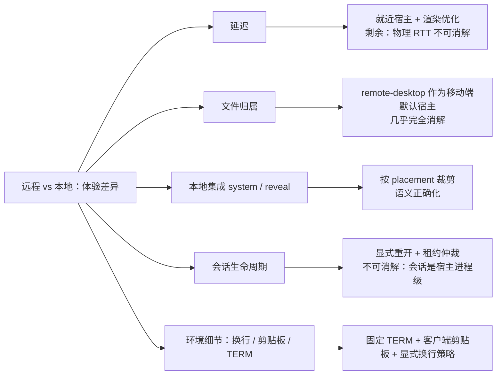

#### 9.9.1 一致性分级

| 维度 | 一致性 | 说明 |
|---|---|---|
| Helix/引擎本体语义（模式、textobject、`:w`、高亮） | ✅ **完全相同** | 同一个二进制、同一份 runtime，PTY 位置不影响其行为 |
| 渲染保真（真彩色、鼠标上报、备用屏、宽字符、括号粘贴） | ✅ 基本相同 | 取决于**客户端终端组件**能力，与 PTY 位置无关 → 中文 IME 的风险属于终端组件，本地/远程同样要解决 |
| 按键回显延迟 | ❌ **明显不同** | 见 8.9.2 |
| 文件归属 | ❌ **语义反转** | 本地 = 你的文件；远程 = 宿主上的文件 |
| 本地集成（`system`/`reveal`、git、构建） | ❌ 断裂或反转 | 由 placement 决定（§9.2 修正表、§9.8） |
| 会话生命周期 | ⚠️ 远程多一个优势、多两个硬约束 | 见 8.9.3 |
| 环境细节（换行、大小写、剪贴板、`TERM`、CPU） | ⚠️ 不一致 | 见 8.9.4 |

#### 9.9.2 延迟：为什么 TUI 藏不住

- 本地 PTY 往返**亚毫秒级**；远程同区域 5–30ms、跨洲 100–250ms、移动网络抖动可达 200ms+。
- 关键在于：**终端程序是"每次按键同步重绘"的，客户端拿不到屏幕状态，因此无法做乐观回显**（GUI 编辑器可以先把你敲的字画上去再等服务端确认；TUI 的屏幕归 `hx` 所有，只能等它把重绘字节流发回来）。所以 RTT 被**直接感知**：快速输入时字一个个"追"上来、鼠标拖选发黏、翻页呈分批刷漆。
- 可缓解：宿主就近（边缘/同城）、WS 不被中间代理缓冲、canvas/WebGL 渲染、关闭不必要的鼠标上报；**不可根治**：物理 RTT。

**延迟预算（验收线）：**

| 指标 | 目标 | 超限处置 |
|---|---|---|
| 本地回显 | < 16ms（一帧） | 视为缺陷 |
| 远程回显 RTT | < 60ms | 主观无可感，不做提示 |
| 远程回显 RTT | 60–150ms | 面板常驻标注"远程会话" |
| 远程回显 RTT | > 150ms | 显式提示可能卡顿，并建议切换到更近的宿主（§9.8） |

#### 9.9.3 会话生命周期与多设备

- **优势**：PTY 在宿主 → 会话**跨设备/跨应用重启存活**，这是本地 PTY 给不了的。
- **硬约束 1**：`@deepseek-ai/dsh-terminal` README：*"Sessions are process-local and are not restored after a harness restart"* → 宿主重启后必须**显式重开会话**，不得静默失败（与 I4 一致）。
- **硬约束 2**：同一会话 *"accepts at most one live send operation"* → 两台设备同时输入时第二个 `send` 会失败。**多端共享必须做租约/焦点仲裁**（I12），不是"都连上就行"。

#### 9.9.4 环境细节差异与处置

| 项 | 本地 | 远程 | 处置 |
|---|---|---|---|
| 换行 | CRLF（Windows） | LF | 提示 + 明确的保存转换策略 |
| 路径 | `C:\`、`/Users/…` | `/home/…` | 显示宿主真实路径，**不映射成假的本地路径** |
| 剪贴板 | 系统剪贴板，免费 | 需 OSC 52 透传（安全敏感，多数终端默认禁用） | 复制走客户端"复制选区"，粘贴走客户端→PTY 写字节 |
| `TERM`/字体/emoji | 本机配置 | 宿主 terminfo 可能缺条目 | 固定 `TERM=xterm-256color`、`COLORTERM=truecolor` |
| CPU | 自己的机器 | 可能是共享实例 | 放置标注（§9.8.1）便于归因性能问题 |

#### 9.9.5 把差异降到最低的三条设计动作

1. **承载面必须标注"宿主归属"**：`local-embedded` / `remote-desktop` / `remote-cloud-tenant` / `remote-cloud-shared` + 延迟档位——用户必须一眼看出"我改的是哪台机器上的文件"。
2. **偏好允许强制选择**："优先本地打开 / 优先远程打开"，因为同一份文件在各端的最优承载器本来就不同。
3. **移动端默认推荐 `remote-desktop` 作为宿主**（§9.8.4）：一次投入同时消掉"文件归属断裂"与"iOS 无本机 PTY"两个最硬的体验问题——手机连自己的桌面时，PTY 在你自己的 Mac 上，编辑的就是你的本地文件。

> 关于领域建模：先前讨论中提议的 `ExecutionPlacement` 已由 §9.8.5 的 `HostPlacement` + `HostEndpoint` 表达，不再单列概念。

#### 9.9.6 新增不变量

| ID | 不变量 |
|---|---|
| **I19** | 任何承载面必须可见地标注宿主归属与延迟档位（可展示的 `HostEndpoint.placement`），不得让用户误以为在编辑本机文件 |
| **I20** | 会话中断必须显式：宿主重启（会话不恢复）或断线时给出明确回执与重开入口，不得静默失败（与 I4 一致） |
| **I21** | 客户端不得缓存或回放来自旧宿主/旧 epoch 的屏幕内容（与 I16 一致），避免"看似还在编辑"的错觉 |

### 9.10 多端图示

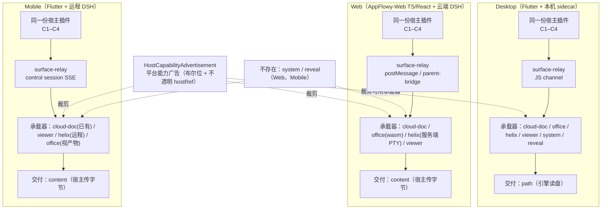

## 10. 关键图示

### 10.1 限界上下文与上下文映射

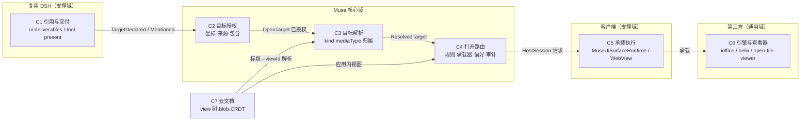

### 10.2 双插件平面与 seam 拓扑（DSH 同款三分类）

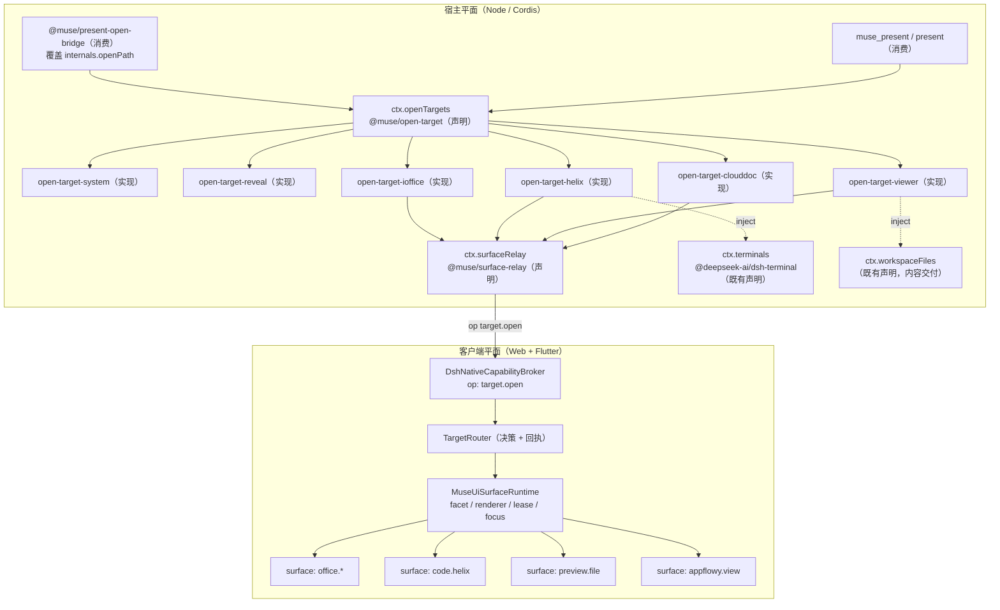

### 10.3 领域模型

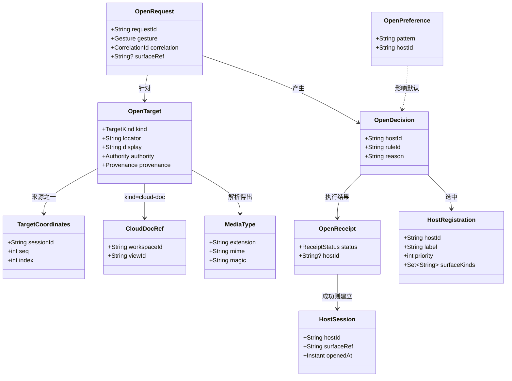

### 10.4 打开链路时序

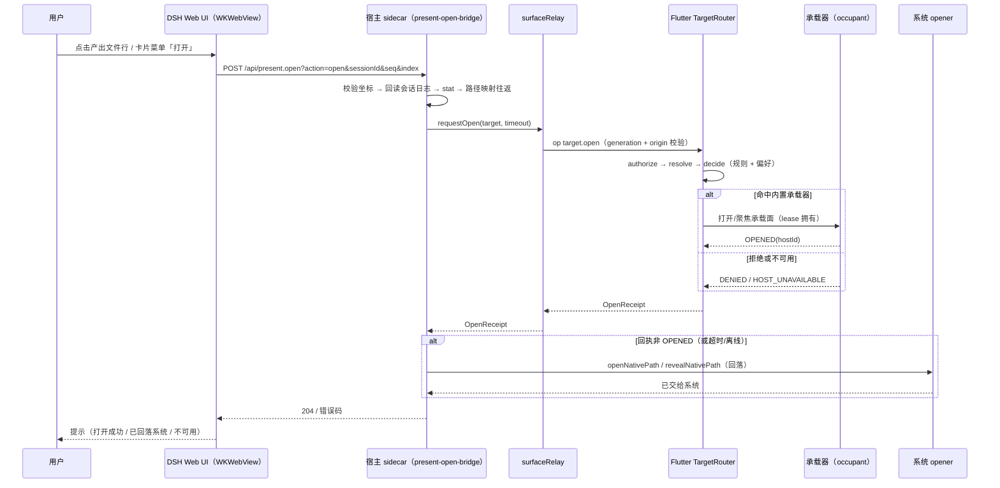

### 10.5 路由决策流程

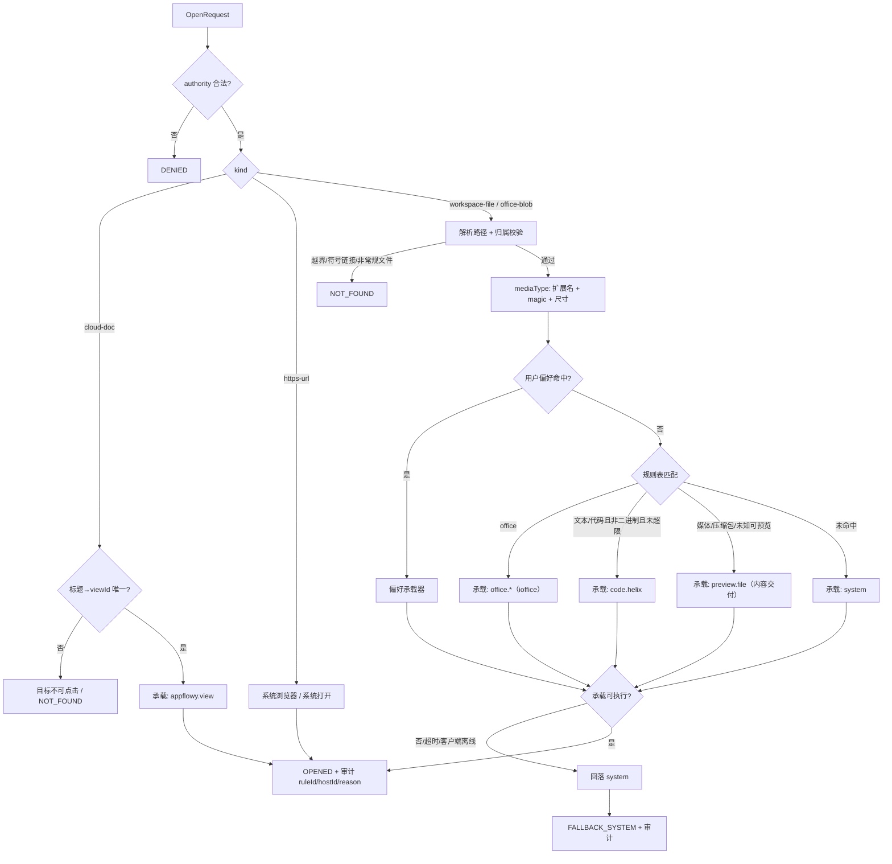

### 10.6 目标与承载会话生命周期

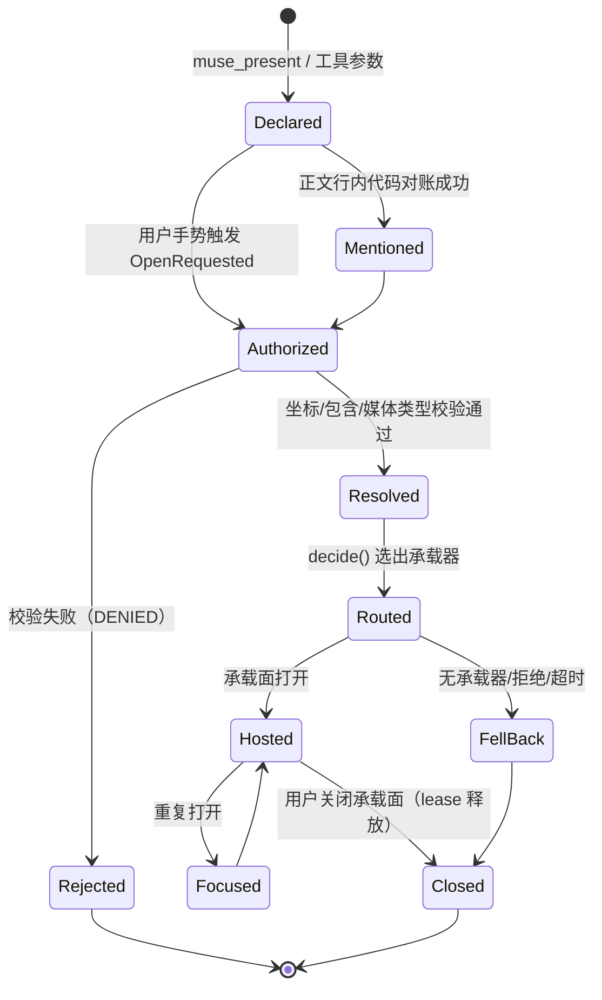

### 10.7 打包与部署视图

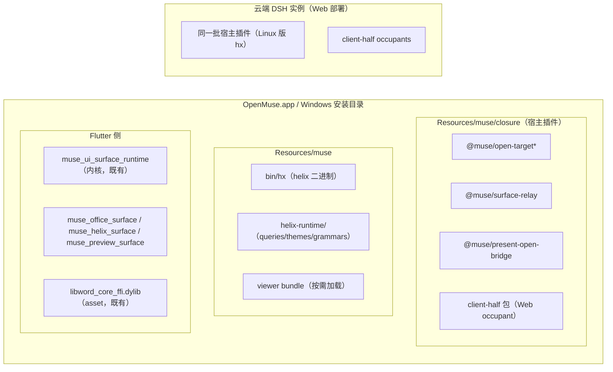

---

### 10.8 宿主放置与无缝切换

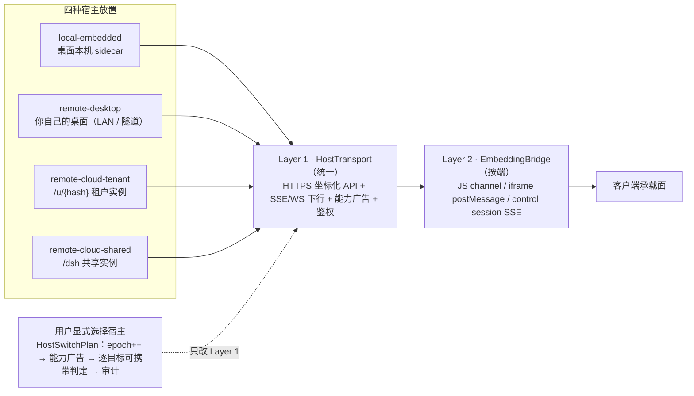

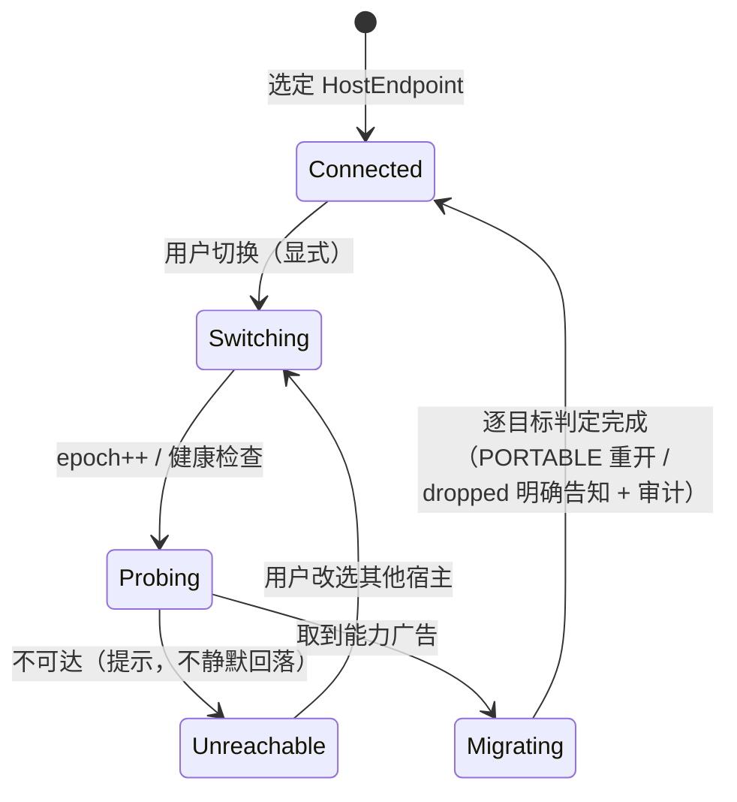

### 10.9 统一资源协议与能力阶梯

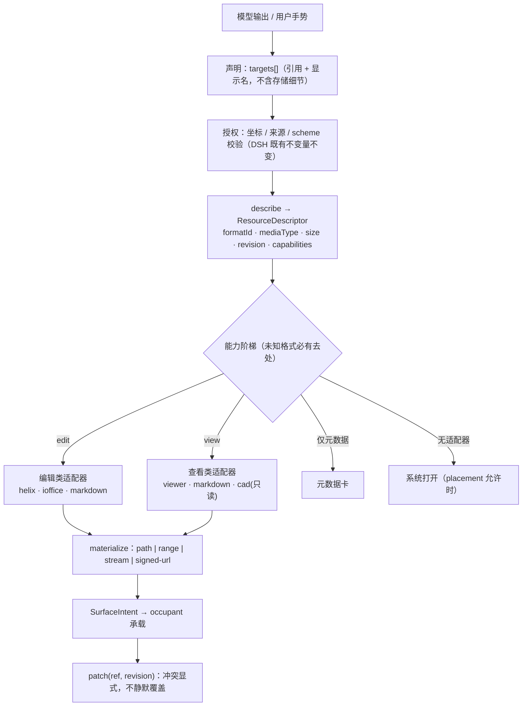

### 10.10 适配器拓扑（引擎与格式皆为数据）

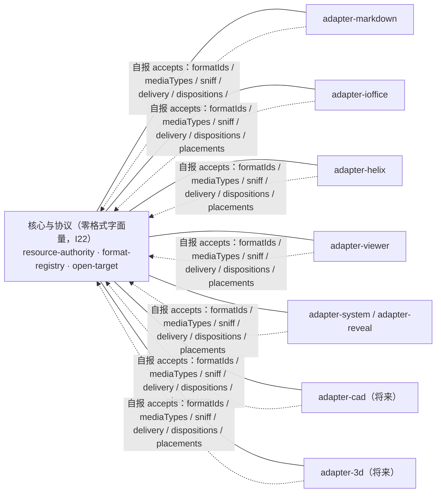

## 11. 分期、验收、风险与未决

### 11.1 分期

| 期 | 内容 | 验收 |
|---|---|---|
| **P0（2–3 天）** | ① 确认 `internals.openPath` 注入方式；② 打通 `target.open` op（宿主→客户端→回执→回落）；③ 最小路由：`.md → helix 占位承载` + 其余回落系统；④ 核验 `ui-deliverables` 是否暴露卡片菜单扩展点 | 点击产出文件行的"打开"，Flutter 侧收到请求并能承载；回落路径可用；**不存在"点了没反应"** |
| **P0 附加**（体验基线） | 承载面标注宿主归属（I19）；埋点测量回显延迟（§9.9.2） | 面板可见地显示"哪台机器 + 延迟档位"；四个延迟档位各有一条测量记录 |
| **P0 附加（协议自检）** | 用"假格式"（如 `.xyz`）验证扩展性：只加适配器与格式描述符，协议/核心/DSH 零改动；并加 **I22 零格式字面量** 的 grep 断言 | 假格式可被声明、路由、承载、回写；断言通过；**Markdown 与 office 走完全相同的注册路径** |
| **P1（1–2 周）** | `@muse/open-target` + `surface-relay` 契约包；六个承载器中先落 `system`/`reveal`/`office`；规则表 + 偏好 + 审计日志；错误提示 | 扩展名矩阵用例全通过；每条回执含 `{ruleId, hostId, reason}`；卸载插件后路由无残留 |
| **P2（1–2 周）** | `helix` 承载（依赖 helix 设计稿 P0/P1）；`viewer` 承载（内容交付 + WebView 容器 + 按需加载） | helix/viewer 各有一组端到端用例；内容交付有读上限与本地解析证明（不上传） |
| **P3** | 云文档目标进入可点击词表（`muse_present` + 行内标题解析 + 桌面下行）；通路 B（`/muse/v1/target.open` + "打开方式…"菜单） | 输出流里的文档标题可点击并打开应用内视图；歧义标题不可点击；菜单列出可用承载器且偏好持久化 |

> 上表是 **Desktop 主线**。Web 与 Mobile 的落地顺序见 §9.7，按端成本见 §9.6，硬约束见 §9.5（K1/K2 必须尽早 spike）。

### 11.2 风险

| 风险 | 影响 | 缓解 |
|---|---|---|
| `internals` 注入不可行 | 通路 A 受阻 | P0 先验证；退回通路 B（自建端点 + 前端菜单） |
| 客户端不在线/面板未挂载 | 打开失败 | 一律回落系统打开；`attached()` 为空时立即回落（I4） |
| `ui-deliverables` 无菜单扩展点 | 无法加"打开方式…" | 通路 A 不依赖菜单（opener 覆盖即可）；菜单为 P3 增量 |
| open-file-viewer 需内容跨线 | 暴露层级上升 | 走 `ctx.workspaceFiles` 只读 + 读上限 + 不落盘副本；转换插件默认关 |
| 承载器互相抢占同一 surface kind | 渲染冲突 | `MuseRendererRegistry` 已抛 `RENDERER_CONFLICT`；规则表显式优先级 |
| 云文档标题不唯一/模型编造标题 | 打开错误文档 | 不唯一即不可点击（I3）；ID 由 host 解析 |
| 新插件未入闭包/未纳入 git | 静默不生效或打包失败 | `assert_packed_runtime()` + `verify-macos-app.py` 断言；新目录必须提交 git |
| 引擎体积（helix grammars / viewer bundle） | 包体膨胀 | helix 语言子集 + viewer 按需加载 |
| **iOS 不能启动本地进程**（K1） | Mobile 的 helix 只能远程 | 远程 PTY；否则 Mobile 不提供该承载器 |
| **iOS 不能 dlopen 任意动态库**（K2） | ioffice 在 iOS 需改静态链接分支 | 先 spike XCFramework + FRB iOS 集成，再排期 |
| **Web/Mobile 无本机打开语义**（K3/K4） | 提供必然失败的选项 | 能力广告裁剪 + `DeliveryMode` 显式建模 |
| **下行通道三套**（K5） | 回执语义分散 | 收敛为"Layer 1 统一 + Layer 2 按端"（§9.8.1），I4 统一回执 |
| **Muse 客户端无隧道/配对代码** | `remote-desktop` 无法落地 | 照 dsh-desktop 先例自建（配对 + LAN bridge + Cloudflare/Pinggy 回落），3–5 人周 |
| **远程延迟不可根治**（§9.9.2） | 高频输入体感差 | 就近宿主 + 延迟档位提示 + 移动端默认连自己桌面；不承诺"与本地完全一致" |
| **用户误以为在编辑本机文件** | 数据风险/困惑 | I19 宿主归属常驻标注 + I14 显式切换 |

### 11.3 未决问题

1. `internals.openPath` 注入方式（构造期 vs 组合覆盖）——P0 第一件事。
2. `ui-deliverables` 是否暴露卡片菜单/行内链接的扩展点（决定通路 B 的成本）。
3. `muse_present` 独立工具 vs 扩展上游 `present`（跟随上游的成本 vs 复用 UI 的便利）。
4. 桌面端 host→client 下行放哪个通道：JS channel（页面发起，天然带来源栅栏）还是独立客户端长连（可离屏请求）。
5. open-file-viewer 的 content 交付形态：一次性只读 URL vs 经 `ctx.workspaceFiles` 分页字节。
6. 偏好存储位置与是否跨端同步。
7. helix 承载所需 grammars 交付方式（全量随包 vs 子集 + 按需下载）。

---

## 附录 A：参考实现文件索引

| 关注点 | 文件 |
|---|---|
| 标记 UI 与打开链路（参考实现） | `vendors/deepseek-harness/packages/client/ui-deliverables/{README.zh.md,src/present-open.ts,src/presented.ts,src/client/*}` |
| 默认 opener（平台语义） | `vendors/deepseek-harness/packages/util/native-command/src/path-opener.ts` |
| 可注入的打开缝 | `vendors/deepseek-harness/packages/api/session-controller/src/index.ts:72-141,281-315` |
| 暴露层级区分的原文 | `vendors/deepseek-harness/packages/api/workspace-files/src/index.ts:1-20` |
| 插件教义 | `vendors/deepseek-harness/README.zh.md:7`、`docs/cordis-primer.zh.md`、`docs/capability-seams.zh.md` |
| seam 自我约束范例 | `vendors/deepseek-harness/packages/terminal/terminal/README.md` |
| 桌面端是否自实现打开 | `vendors/dsh-desktop/src/main/index.ts`（结论：否） |
| 客户端插件内核 | `Muse-Clients/frontend/client/frontend/appflowy_flutter/packages/muse_ui_surface_runtime/lib/src/kernel.dart` |
| 既有表面注册范例 | `packages/muse_word_surface/lib/muse_word_surface.dart:7,172-180`、`packages/muse_table_surface/lib/muse_table_surface.dart:7,97` |
| Muse 云文档意图通路 | `Muse-Clients/middlewares/dsh/plugins/dsh-appflowy/src/parent-bridge.ts` |
| Muse 云文档读取授权 | `Muse-Clients/middlewares/dsh/plugins/appflowy-view-reference/{src/index.ts,README.md}` |
| WebView ↔ Flutter op 通道 | `Muse-Clients/middlewares/dsh/mobile/muse-dsh-mobile/lib/src/capabilities/dsh_native_capability_broker.dart` |
| 客户端导航与 facet 发布 | `.../lib/plugins/dsh_agent/appflowy_dsh_control_host.dart` |
| office blob 落盘 | `.../rust-lib/flowy-core/src/deps_resolve/folder_deps/office_blob.rs` |
| 打包钩子与断言 | `frontend/client/scripts/lib/muse_windows.py`、`scripts/verify-macos-app.py` |
| 终端会话 seam 的两条硬约束（会话不恢复 / 一次一个 send） | `vendors/deepseek-harness/packages/terminal/terminal/README.md:16,40` |
| ioffice 平台矩阵 | `vendors/ioffice/word/DISTRIBUTION.md`（第 3 节） |
| ioffice Web 路径（wasm MVP） | `vendors/ioffice/word/wasm-mvp/{README.md,build.sh,Cargo.toml,www}` |
| Web 端技术栈 | `Muse-Clients/frontend/web/package.json`（`appflowy_web_app`，React）+ `frontend/web/deploy` |
| 移动端远程会话与放置 | `middlewares/dsh/mobile/muse-dsh-mobile/lib/src/{dsh_remote_config.dart,dsh_placement.dart,dsh_mobile_coordinator.dart}` |
| 能力协商先例 | `middlewares/dsh/mobile/muse-dsh-mobile/lib/src/capabilities/dsh_native_capability_host.dart`（`DshNativeCapabilities`） |
| **远端放置在客户端的既有实现** | `middlewares/dsh/mobile/muse-dsh-mobile/lib/src/{dsh_remote_config.dart,dsh_placement.dart}`（origin allowlist、`/dsh` 共享 vs `/u/<hash>` 租户） |
| **桌面当宿主（配对桥）先例** | `vendors/dsh-desktop/src/main/mobile/{lan-mobile-bridge.ts,internet-tunnel.ts,cloudflared-tunnel.ts,pinggy-tunnel.ts,lan-mobile-pages.ts}`；README.zh.md「手机连接」 |
| **云端会话签发（多租户）** | `middlewares/dsh/core/dsh-pool/`（`/api/muse/dsh/session/open` → `/internal/session/open`，membership 检查） |

## 附录 B：不变量 → 测试映射

| 不变量 | 测试形态 |
|---|---|
| I1 权威来源 | 构造伪造请求（自由路径）→ 断言 `DENIED` |
| I2 工作区包含 | `..`、符号链接、目录、设备文件 → 断言 `NOT_FOUND` |
| I3 云文档授权 | 模型编造 viewId / 标题歧义 → 断言不可点击 |
| I4 恰好一个回执 | 离线/超时/拒绝/成功四条路径各断言一次回执，禁止无回执分支 |
| I5 单会话 | 同 target 连续两次打开 → 断言第二次是 `Focused` 而非新会话 |
| I6 注册对称 | 装载→断言注册数；卸载→断言路由与 renderer 表清空 |
| I7 可审计 | 任意打开 → 断言日志含 `{ruleId, hostId, reason}` |
| I8 偏好非后门 | 偏好指向不可用承载器 → 断言回落而非绕过校验 |
| I9 暴露层级 | viewer 承载 → 断言字节来源是 `workspaceFiles` 且带读上限 |
| I10 代次栅栏 | 旧 generation 消息 → 断言被丢弃（对齐 `STALE_GENERATION`） |
| I11 广告一致 | 在 `systemOpen=false` 的平台装载 system 承载器 → 断言拒绝注册 |
| I12 跨设备单会话 | 桌面已开 → 移动端再开同一目标 → 断言为聚焦/接管而非新会话 |
| I13 内容交付上限 | 超大文件 → 断言分页读取且不整文件驻留 |
| I14 显式切换 | 桌面不可达 → 断言不自动连云端，且切换审计含 portable/dropped |
| I15 凭据隔离 | 切换后再回原宿主 → 断言两套凭据互不覆盖；launch token 不出现在日志 |
| I16 epoch 栅栏 | 切换后投递旧宿主回执 → 断言被丢弃 |
| I17 placement 裁剪 | 在 `remote-cloud-*` 装载 `system`/`reveal` → 断言拒绝注册 |
| I18 最小 RPC 面 | 远端桌面请求 allowlist 外端点 → 断言拒绝；未批准配对 → 断言拒绝 |
| I19 宿主归属可见 | 各 placement 下 → 断言承载面显示归属与延迟档位 |
| I20 中断显式 | 宿主重启后访问旧会话 → 断言给出明确回执与重开入口，而非静默失败 |
| I21 无旧屏回放 | 切换宿主后 → 断言不渲染旧 epoch 的屏幕内容 |
| I22 零格式字面量 | 对协议/核心包 grep 扩展名与 MIME 白名单 → 断言为空 |
| I23 协议版本化 | 旧协议版本客户端 + 新适配器 → 断言能力协商后安全退化 |
| I24 能力阶梯 | 只读格式请求 edit → 断言降级到 view；无适配器 → 断言降级到 system |
| I25 回写冲突 | 携带过期 `revision` 回写 → 断言显式冲突而非覆盖 |
| I26 模型不选引擎 | 模型给出 `engineId` → 断言被忽略并走策略选择 |
| I27 资源租约 | 同一资源第二个编辑承载 → 断言获得只读或排队，而非双写 |
| I28 交付配额 | 请求超大 `stream`/`signed-url` → 断言配额与 TTL 生效 |


---

## 附录 C：适配器一致性测试套件（新增格式的准入清单）

任何新引擎/新格式（含未来的 CAD、三维、以及把 Markdown 纳入普通 occupant 的改造）都必须通过以下检查，否则不得入库。这套套件就是"新增格式不改核心"的可执行证明。

| # | 检查 | 通过判据 |
|---|---|---|
| C1 | **声明完整** | `EngineAdapter.accepts` 的 `formatIds`/`mediaTypes`/`delivery`/`dispositions`/`placements` 全部显式声明，无 `any` 兜底 |
| C2 | **零核心改动** | 本次接入的 diff 不触及 `@muse/resource-*`、`@muse/open-target`、DSH 协议包（CI 断言路径白名单） |
| C3 | **零格式字面量** | 核心包 grep 扩展名/MIME 为空（I22） |
| C4 | **能力阶梯** | 构造"能编辑/只能看/只有元数据/无适配器"四种输入，逐一断言降级路径（I24） |
| C5 | **嗅探正确性** | 扩展名与真实内容不符时（改名的二进制、无扩展名文件），断言按 magic 判定 |
| C6 | **交付模式** | 对该适配器声明的每种 `DeliveryMode` 各跑一条端到端用例；未声明的模式断言被拒绝 |
| C7 | **回写与冲突** | 正常回写成功；过期 `revision` 断言显式冲突（I25） |
| C8 | **租约** | 同一资源并发两个编辑承载 → 断言单写者（I27） |
| C9 | **放置裁剪** | 在不支持的 placement 上断言适配器不注册（I17） |
| C10 | **卸载可逆** | 卸载适配器后 → 断言路由、渲染注册表、格式注册表均无残留（I6） |
| C11 | **打包可见** | 新包进入闭包清单与 verify 断言，缺件 fail fast |
| C12 | **安全不变量** | 复核 §3.6 全部条目（坐标化、日志回读、工作区包含、代次栅栏、内容不越界） |

> Markdown 作为"第一个非特权 occupant"改造时，必须与 office/helix 用**同一套 C1–C12** 验收。若 Markdown 需要任何豁免，说明协议尚未真正统一，应回到 §4.1 重审。
