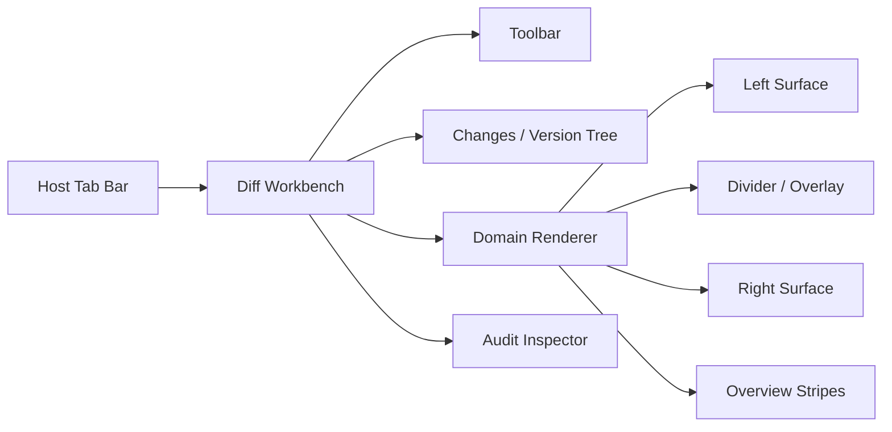

# IntelliJ 级 Universal Diff Workbench 产品重设计

状态：设计基线（Version Diff 1.0）  
适用端：macOS Host 优先，随后 Windows/Linux；移动端仅提供审阅模式  
参考：IntelliJ IDEA / Android Studio 的双栏 Diff 交互与 `vendors/intellij-community` 的分层思想，不复制 Swing 实现或品牌资产

## 1. 为什么必须重做

当前 `MuseTextDiffViewer` 把每个 Hunk 渲染成独立卡片。它能说明“存在若干增删改”，但不能回答用户真正关心的三个问题：

1. 我正在比较的两个完整版本各处于什么上下文？
2. 左右两边的某一行、段落或对象为什么对应？
3. 当我滚动、折叠、搜索、选择、复制或应用变化时，两个版本如何保持同一语义位置？

IntelliJ 的体验来自两个完整编辑表面，而不是一组 Diff 卡片。OpenMuse 需要把 Diff 从一个结果列表升级为 Host 内的一等工作台：它与普通资源 Tab 共存，在当前窗口内打开，复用统一 Tab、插件菜单、权限、审计和 DSH 上下文。

### 1.1 当前实现与目标的差距

| 维度 | 当前实现 | 目标实现 |
|---|---|---|
| 内容表面 | Hunk 卡片中的局部行 | 左右两个连续、可导航的完整资源表面 |
| 坐标 | ListView item 坐标 | 左/右领域坐标 + 视觉坐标 + 语义锚点 |
| 关联 | 同一卡片内并排 | Divider 曲面连接、选择联动、悬停联动 |
| 滚动 | 单 ListView | 双表面同步滚动，变化区间内插映射 |
| 折叠 | 折叠整个 Hunk | 折叠未变化区，波浪边界与上下文行 |
| 对齐 | 行按卡片排列 | 插入虚拟空间，对齐变化块并感知折叠/软换行 |
| 高亮 | 行背景 | gutter、整行、行内、边界、概览条多层高亮 |
| 版本审计 | 独立对话框 | 版本树/变化树、Diff、审计 Inspector 联动 |
| 任意资源 | 文本 payload | 通用 ChangeSet + 领域 PresentationPlan |
| 大文件 | 全文进入 Dart Widget | 后台计算、窗口化数据、取消、增量重算 |

## 2. 产品定位

Universal Diff Workbench 是 Agent Native Knowledge Platform 的“变化理解面”。它不是 Git UI，也不是另一个 Office；它让任意资源的两个或三个不可变版本，在同一套审阅生命周期下，由对应领域解释并呈现变化。

它必须同时服务：

- 用户查看自己、同事或 Agent 对资源做了什么；
- Agent 在 DSH 中引用一个 Comparison，Host 定位到具体变化；
- 审计员从 Actor、时间、意图、工具调用追溯到版本与变化；
- 插件为 Word、PPT、Excel、PDF、图片、音视频、CAD 注册领域 DiffProvider 和 Renderer；
- 后续 Proposal/三方合并复用同一 Change Model，但不把接受/拒绝逻辑耦合进 Diff 计算。

## 3. 不可破坏的产品原则

### 3.1 Version、Diff、Viewer、Action 四者解耦

```text
Version = immutable state
Diff = relation(version A, version B)
Viewer = presentation(diff, viewport, user preferences)
Action = decision(change, target, policy)
```

Diff 可以重新计算，Viewer 可以替换，Action 可以受权限控制；Version 事实不因此变化。

### 3.2 通用层只统一生命周期，不统一视觉隐喻

代码适合双栏行 Diff；PPT 适合幻灯片列表与对象 Overlay；视频适合时间轴；CAD 适合场景树与 Ghost Overlay。所有领域共享版本、审计、ChangeSet Envelope、命令与选择协议，但不共享一种画布。

### 3.3 Diff 是当前 Tab 的一种 Surface Mode

比较结果在 Host 当前窗口和 Tab 栈中打开，不创建独立系统窗口。关闭 Diff Tab 后回到原资源 Tab；从 DSH 点击 Comparison 或具体 Change 时，复用/激活相同 Diff Tab。

### 3.4 Audit 记录事实引用，不复制敏感内容

审计事件记录 Version、Comparison、Change、Actor、工具与策略引用。文本预览、Office 对象内容、视频片段不写入 append-only 审计 metadata；授权查看时从不可变 Version 和 Provider 派生。

## 4. 核心用户场景

### 4.1 开发者审阅 Agent 修改

1. DSH Agent 修改 `workspace/lib/router.ts`，Host 捕获 Proposal Version。
2. 对话流显示“修改了 4 处”，点击后在当前 Host Tab 打开 Comparison。
3. 默认进入 Side-by-side：左侧基线、右侧 Agent 版本；光标定位第一处变化。
4. 用户滚动任一侧，另一侧按相似块边界同步；新增大块通过对齐空间保持对应语义位置。
5. 用户通过上一处/下一处、概览条、变化树快速导航；悬停连接面时两侧变化同步强调。
6. Inspector 显示 Agent、模型/工具调用、意图、时间、父版本和审计链。

验收：用户不离开当前窗口即可选择、复制、搜索、折叠与查看完整上下文；DSH 深链定位误差不超过目标变化起始视觉行 1 行。

### 4.2 产品经理审阅 Word 规格变化

1. 选择 Word 文档的 v12 与 v15。
2. Word DiffProvider 输出段落、表格、批注、样式和结构变化；稳定对象 ID 用于识别移动而非删除再新增。
3. Renderer 显示双页或 Track Changes 模式，变化树按“章节/表格/对象”组织。
4. 选择“支付失败文案修改”，两边页面自动定位并突出对应段落。
5. Audit Inspector 显示此变更由用户完成还是由 Agent Proposal 产生。

验收：通用层不读取 OOXML 内部对象；禁用 Word Provider 时仍可查看版本事实、摘要和二进制变更状态。

### 4.3 审计员回溯跨资源任务

1. 从任务审计进入 Version DAG，查看同一任务修改的 Markdown、代码、PPT 和 MP4。
2. 左侧 Changes Tree 按资源、语义路径和变化类型分组。
3. 切换资源时 Workbench Shell 不变，中间 Renderer 按资源类型切换。
4. 选择任何 Change，右侧显示 Actor、来源、时间、工具、策略决定和关联工作流。

验收：跨资源审计查询只返回有权限的 Resource；事件链可验证且不含资源明文副本。

### 4.4 大文件与退化模式

1. 用户比较 30 MB 日志或 100 万行生成文件。
2. 系统先显示版本头和计算进度；计算可取消。
3. 超过领域 Provider 精确预算时，显示“快速比较”或“二进制摘要”，用户可显式请求深度比较。
4. Viewer 只请求可见窗口及预取区域，不把全文跨 FFI 复制到 Dart。

验收：取消命令 100 ms 内被计算端观察；UI 线程不因 Diff 计算出现超过 100 ms 的阻塞。

## 5. 信息架构与页面布局



### 5.1 Host Tab

Tab 标题采用 `文件名 (vA ↔ vB)`，显示资源图标、未完成计算指示、关闭按钮和标准右键菜单。菜单可由插件贡献：

- Compare With…
- Swap Sides
- Open Version
- Copy Version/Comparison Link
- Show Audit
- Reopen With…
- Provider 自定义动作

同一 `comparisonId` 默认只保留一个 Tab；不同视图偏好属于 Tab Session，不产生新 Comparison。

### 5.2 Toolbar

桌面端从左到右：

- 上一处、下一处；
- Side-by-side / Unified / 领域专用模式；
- Ignore Policy（不忽略、空白、大小写、领域噪声）；
- Highlight Policy（行、词、字符、语义对象）；
- Align changes、Sync scroll、Collapse unchanged；
- 反转左右版本；
- `当前序号 / 总变化数` 与计算状态；
- 设置和帮助。

Toolbar Action 由能力协商生成，不显示 Renderer 不支持的动作。

### 5.3 桌面文本布局

```text
┌──────────────────────────────── Toolbar ────────────────────────────────┐
│ Changes Tree │ BEFORE editor │ divider/connectors │ AFTER editor │Audit│
│              │ line gutter   │ apply/navigation   │ line gutter  │     │
│ resource     │ full document │ hover/selection    │ full document│actor│
│ semantic path│ overview bar  │                    │ overview bar │trace│
└──────────────────────────────── Status Bar ─────────────────────────────┘
```

- Changes Tree 和 Audit Inspector 均可折叠；中间 Renderer 始终占剩余空间。
- 小于 900 dp 时自动隐藏 Inspector；小于 680 dp 时 Side-by-side 降级为 Unified，但用户可手动横向滚动保持双栏。
- Divider 推荐 36–56 dp，可容纳连接面、应用箭头和命中区域；视觉连接面不能截断左右编辑区。
- 编辑区宽高必须由父级 LayoutBuilder 约束，禁止基于物理屏幕宽度或固定像素布局。

### 5.4 颜色和视觉层级

语义颜色来自 Host Theme Token，不在 Provider 中写死：

| 变化 | 背景 | 行内强调 | gutter / overview |
|---|---|---|---|
| Insert | 低饱和绿色 | 高饱和绿色 | 绿色标记 |
| Delete | 低饱和红色 | 高饱和红色 | 红色标记 |
| Modify | 低饱和蓝色 | 蓝/黄语义强调 | 蓝色标记 |
| Move | 低饱和紫色 | 源/目标配对边框 | 紫色双标记 |
| Conflict | 橙色 | 橙色边框 | 橙色告警 |

必须同时提供图标、边界或纹理，不允许只用颜色表达；暗色和亮色主题均需达到 WCAG AA 的文字对比度。

### 5.5 Version Graph 与 Audit Timeline

Workbench 左侧不是把 Git Tree 硬编码进所有资源，而是提供两种通用投影：

- `Version Graph`：按 Version parents 展示 DAG。主线为资源当前 head，分叉可以来自离线编辑、Agent Proposal、远端同步或协作分支；Merge Version 有两个或更多 parents。
- `Audit Timeline`：按时间展示事实事件，支持按 Actor、Agent/User、动作、Provider、Task/Workflow、设备和结果筛选。

选择两个 Version 后直接创建 Comparison；选择一个 Version 和 working state 则比较历史与当前。Graph 节点只显示摘要、Actor、时间、状态和标签，不假定存在 Git commit。资源 Provider 可以贡献缩略图或领域摘要，但不能改变 DAG 语义。

```text
v12 ── v13 ───────── v16 (current)
         ╲            ╱
          v14 ── v15        Agent proposal / merge
```

Graph、Timeline、Changes Tree 是三个不同投影：Graph 回答“版本从哪里来”，Timeline 回答“谁在何时做了什么”，Changes Tree 回答“两个版本之间改了什么”。三者通过 Version/Comparison/Change ID 联动，但不能混成一张含义不清的树。

## 6. 功能要求

### 6.1 比较请求

- 2-way：before / after。
- 3-way：local / base / incoming，为 Proposal 合并预埋。
- Version 可以来自 Local、AppFlowy Collab、SSH 或 Cloud；Viewer 不感知存储位置。
- 比较选项可持久化为用户偏好，但不可改变原始版本或审计事实。

### 6.2 变化导航

- 上一处/下一处基于当前可见且未过滤的 Change。
- Changes Tree 支持按资源、语义路径、类型、Actor、状态分组和筛选。
- Overview Stripe 点击可跳转；键盘快捷键与 Host Command Registry 集成。
- DSH Deep Link 最少包含 repository/resource/comparison/change，不包含本地绝对路径或内容。

### 6.3 选择、复制与搜索

- 两侧文本表面支持原生语义的选择、复制、查找、行号和键盘导航。
- 选择只属于一侧，不跨 Divider；“复制变化”是显式命令。
- 搜索命中和 Diff 高亮属于不同渲染层，二者不能互相覆盖。
- 对于不可编辑的历史版本，输入法、粘贴和写操作必须被禁用，但文本选择仍可用。

### 6.4 折叠与对齐

- 默认折叠超过阈值的未变化区，保留头尾上下文行。
- 折叠边界使用波浪或明确的“隐藏 N 行”控件；点击同时展开对应两侧。
- Align Changes 通过视觉填充区对齐插入/删除块；不修改文档内容和行号。
- 折叠、软换行、字体、缩放改变后异步重算布局；旧布局在新布局提交前保持可用。

### 6.5 Audit Inspector

每个 Change 最少显示：

- Actor 类型（User / Agent / System）、身份和组织；
- Version 与父版本；
- 时间、设备/Agent Session、来源工具；
- Proposal/Task/Workflow 引用；
- Provider 解释、置信度和退化原因；
- 权限允许时的内容预览，由 Provider 按需生成。

审计面板的 Insert/Delete/Modify 必须与 Renderer 中的颜色和图例一致。

### 6.6 插件与能力协商

DiffProvider 和 DiffRenderer 可以由同一插件或不同插件提供。Host 依据 `mediaType + schema + capabilities + policy` 选择；用户通过 Reopen With… 覆盖默认 Renderer。

插件可以贡献：

- DiffProvider；
- Renderer；
- Toolbar / context menu actions；
- Inspector sections；
- Ignore/Highlight policy；
- Exporter；
- Change Action handler。

插件不能直接写 Version Store、伪造 Audit Actor 或绕过 Host 权限检查。

### 6.7 版本图与审计查询

- 支持按 Resource、Workspace、Task 和 Actor 查询；默认只展开当前资源，避免跨资源图无限增长。
- Graph 支持 branch/merge、tag、proposal、working 和 remote 状态；这些是平台状态，不等同于 Git 分支。
- 节点菜单包含 Compare with Current、Select for Compare、Open Version、Copy Link、Show Audit；删除/保留受 Provider 和组织策略控制。
- Audit Timeline 的事件选择可以定位 Graph 节点或 Change；无内容权限的审计员只能看到允许的元数据和 redacted 状态。
- 版本 Diff 结果不是必须持久化事实；持久化的是 Comparison 请求、Provider identity、ChangeSet digest 和必要审计证据。

## 7. 端侧功能集

| 能力 | macOS/Windows/Linux Host | 移动端 | DSH |
|---|---|---|---|
| 2-way 双栏 | 完整 | Unified/摘要优先 | 生成链接与摘要 |
| 3-way | 后续完整 | 只读摘要 | 发起/解释 |
| Sync Scroll/Align | 完整 | 不要求 | 不适用 |
| Changes Tree | 完整 | 精简列表 | 对话卡片 |
| Audit Inspector | 完整 | 抽屉 | 对话证据 |
| Provider 插件 | 完整 | 白名单 Renderer | 通过 Host Registry |
| Accept/Reject | Proposal 阶段 | 受限 | 发起命令，Host 确认 |
| 离线 | Local/缓存 | 缓存 | 依赖连接状态 |

## 8. 质量指标

### 8.1 正确性

- 同一版本与同一规范化选项生成确定性的 Change ID。
- 任意 Connector 的端点必须对应左右相同 Change，误差不超过 1 逻辑像素。
- Sync Scroll 稳定后目标锚点漂移不超过 1 个视觉像素；折叠/软换行改变后不超过 1 个视觉行。
- Audit Actor、Version、Comparison、Change 引用完整率 100%。
- Provider 不能解释时必须返回明确退化状态，不能伪造“无变化”。

### 8.2 性能（桌面 P95）

| 场景 | 目标 |
|---|---|
| 5k 行文本已有缓存首帧 | ≤ 350 ms |
| 20k 行文本比较完成 | ≤ 1 s |
| 连续滚动帧耗时 | ≤ 16.7 ms，P99 ≤ 33 ms |
| 下一处变化定位 | ≤ 100 ms |
| Resize 后可交互 | ≤ 100 ms |
| Align 重算提交 | 停止变化后 ≤ 350 ms |
| 取消计算被观察 | ≤ 100 ms |
| 跨 FFI 每帧内容传输 | 仅可见窗口 + 预取，禁止全文 |

### 8.3 稳定性与可访问性

- 24 小时持续打开同一 Diff Tab 不出现无界缓存增长。
- 缩放 80%–200%、系统字体变化和 Retina/非 Retina 显示器下布局正确。
- 键盘可到达 Toolbar、Changes Tree、两侧表面和 Inspector。
- Screen Reader 能读出“删除，第 18 行”“新增，第 21 行”等语义。

## 9. 非目标

- 本阶段不实现 Ontology Runtime 和影响传播。
- 不在通用层实现 OOXML、视频编解码、CAD 几何比较。
- 不把 IntelliJ Swing 代码移植进 Flutter，也不追求像素级复制 IntelliJ 品牌 UI。
- 不在本次重设计中完成 Proposal 接受/拒绝与三方合并，但协议必须允许无破坏接入。
