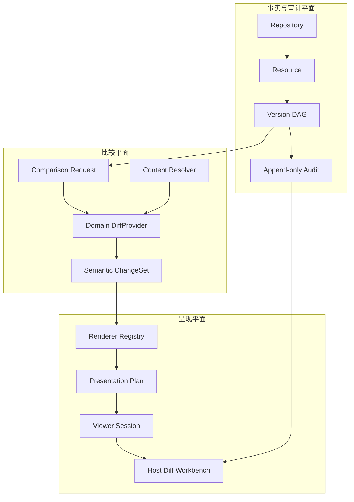
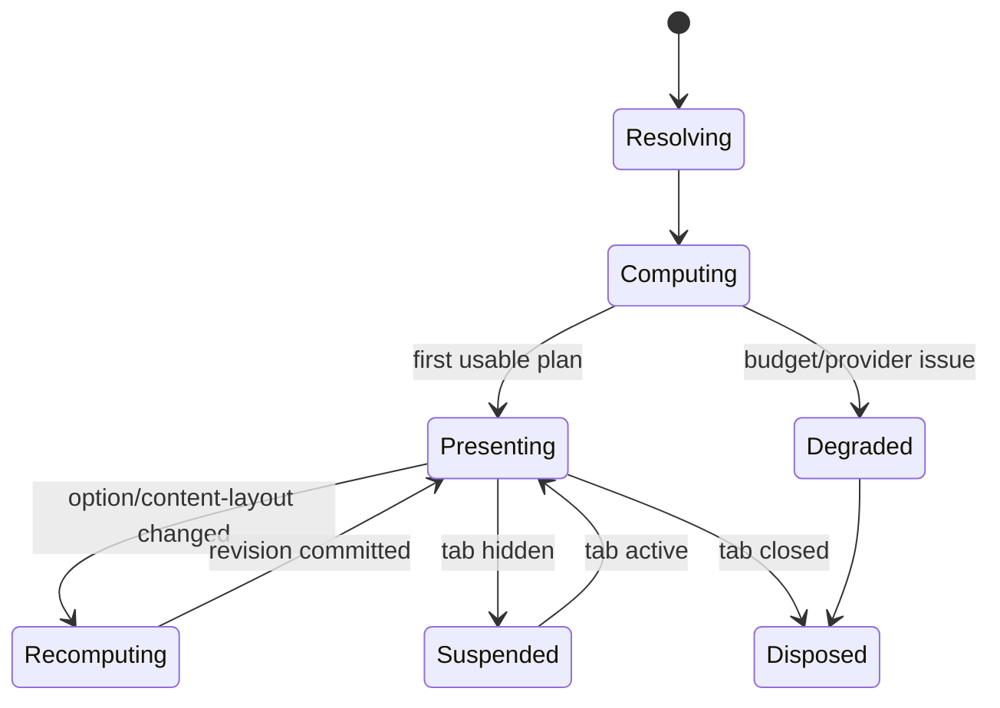
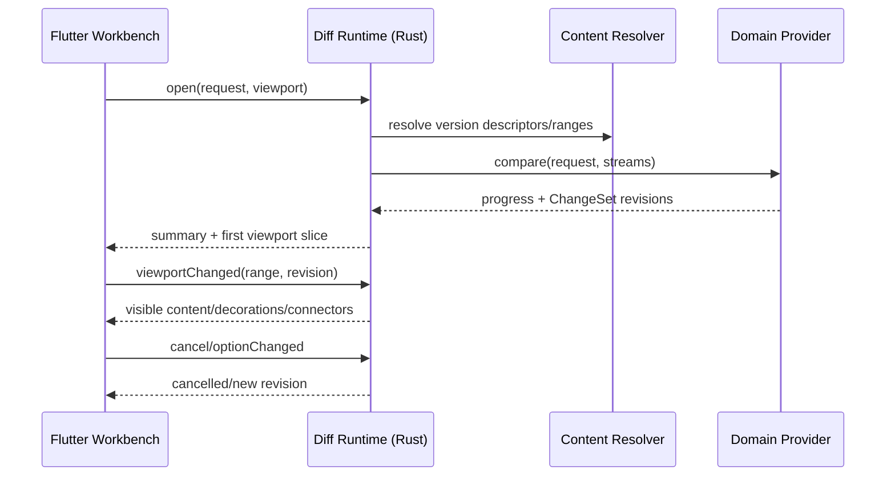

# Universal Version、Audit 与 Semantic Diff 1.0 技术架构

## 1. 架构结论

保留既有六个业务概念：`Repository / Resource / Version / Comparison / Proposal / Action`。新增的 Request、ChangeSet、PresentationPlan、ViewerSession 都是协议或运行时对象，不扩张业务聚合。



核心改动是把当前 `MuseResourceDiff<TPayload>` 的任意 payload 拆成两层：

1. `SemanticChangeSet`：稳定、领域可解释、与具体 UI 无关；
2. `PresentationPlan`：由 Renderer Adapter 生成，服务特定视图、窗口和设备。

这样可以防止将文本 Hunk、行号、颜色或 Flutter Widget 泄漏到通用协议。

## 2. 源码参照与 clean-room 边界

设计参照以下 IntelliJ 源码角色：

| IntelliJ 源码 | 采用的思想 | OpenMuse 对应 |
|---|---|---|
| `diff-api/.../DiffRequest.java` | 请求是可分配、带上下文的展示输入 | `MuseDiffRequest` |
| `ContentDiffRequest.java` | 内容与标题成组，支持 2/3-way | `MuseDiffInput[]` |
| `SimpleDiffViewer.java` | Viewer 编排 model、fold、scroll、toolbar | `MuseDiffWorkbenchController` |
| `SimpleDiffModel.java` | 变化模型与 UI presentation 分离 | `ChangeSetStore` + `PresentationStore` |
| `SimpleDiffChange.java` | Change 可失效、可跟随文档变化 | `ChangeRevision` / `stale` 状态 |
| `SimpleDiffChangeUi.java` | 高亮、gutter、divider 分层 | `TextDecorationPlan` |
| `BaseSyncScrollable.java` | 非交叉相似块边界映射 | `ScrollMapping` |
| `AlignedDiffModel.kt` | 视觉行对齐和 debounce | `AlignmentPlan` |
| `DiffDividerDrawUtil.java` | 可见区裁剪绘制连接面 | `DividerGeometryPlan` |

`vendors/intellij-community` 为 Apache-2.0，但 OpenMuse 仍采取结构借鉴、接口重写和自有视觉 Token；不复制 Swing 绘制代码、图标或 JetBrains 品牌资源。

## 3. 通用协议

以下定义使用 Dart 风格伪代码；序列化使用版本化 JSON/Protobuf，运行时实现不要求使用 Dart class 作为跨进程格式。

### 3.1 Diff Request

```dart
final class MuseDiffRequest {
  String requestId;
  String comparisonId;
  MuseResourceRef resource;
  List<MuseDiffInput> inputs; // 2 or 3
  MuseComparisonOptions options;
  MuseDiffOpenContext context;
}

final class MuseDiffInput {
  MuseDiffSide side;          // before/after or local/base/incoming
  MuseVersionRef version;
  String title;
  bool editable;
}

final class MuseComparisonOptions {
  String algorithmPolicy;
  String ignorePolicy;
  String highlightPolicy;
  String semanticDepth;
  int computationBudgetMs;
  int memoryBudgetBytes;
}
```

`MuseDiffOpenContext` 只包含打开来源、初始 Change、视图偏好和权限上下文，不进入 Comparison identity。修改 Side-by-side/Unified 不应新建 Comparison 或审计事件。

### 3.2 Content Resolver

```dart
abstract interface class MuseVersionContentResolver {
  Future<MuseContentDescriptor> describe(MuseVersionRef version);
  Stream<Uint8List> openBytes(MuseVersionRef version, MuseByteRange? range);
  Future<MuseSemanticIndex?> openSemanticIndex(MuseVersionRef version);
}
```

- Local、Collab、SSH、Cloud 用不同 Resolver；Provider 不拼接真实路径。
- 支持 range/stream，避免大文件全量驻留。
- `contentRef` 是不透明能力引用，不能直接暴露给插件。
- Host 在调用 Provider 前完成 Resource、Version、租户和数据域授权。

### 3.3 Semantic ChangeSet Envelope

```dart
final class MuseSemanticChangeSet {
  String schema;              // muse.diff.changeset.v1
  String providerId;
  String providerVersion;
  String comparisonId;
  MuseResourceRef resource;
  List<MuseSemanticChange> changes;
  MuseDiffSummary summary;
  MuseDiffQuality quality;
  Map<String, Object?> domainIndex;
}

final class MuseSemanticChange {
  String id;
  MuseChangeKind kind;        // insert/delete/modify/move/format/structure/conflict
  String semanticPath;        // domain path, not a filesystem path
  String label;
  List<MuseAnchor> before;
  List<MuseAnchor> after;
  List<String> childIds;
  MuseAttribution attribution;
  Map<String, Object?> properties;
}
```

稳定 Change ID 建议：

```text
hash(provider-schema-version,
     resource-stable-id,
     canonical semantic path,
     normalized before anchors,
     normalized after anchors,
     change kind)
```

不要把行内容、段落明文或用户隐私直接拼入可观察 ID；先计算受控 digest。

### 3.4 Anchor

通用 Anchor 是领域坐标的 tagged union：

| Anchor | 适用 | 示例 |
|---|---|---|
| TextRange | 文本/代码 | UTF-8 byte + UTF-16 + line/column |
| SemanticNode | AST/文档对象 | symbol/paragraph/table stable ID |
| PageRegion | PDF/Word | page + normalized rect |
| CellRange | Excel | sheet stable ID + row/column range |
| TimelineRange | 音视频 | microsecond range + track |
| SceneObject | CAD/3D | object ID + component/property path |
| BinaryRange | 退化模式 | byte offset/length |

Provider 必须声明 Anchor 解释器版本。Anchor 不直接等于屏幕坐标；Renderer 负责从领域坐标投影到当前 viewport。

### 3.5 Attribution

```dart
final class MuseAttribution {
  MuseActorRef actor;
  String? taskId;
  String? agentSessionId;
  String? toolCallId;
  String? intent;
  double? confidence;
}
```

Attribution 可来自版本提交、Proposal 或受信任的操作日志。Provider 只能引用 Host 已验证的 Attribution，不能自行指定 Actor。

### 3.6 Quality 与退化

`MuseDiffQuality` 必须显示而非隐藏能力缺失：

- `exact`：领域语义完整；
- `structural`：结构完整，部分属性未解释；
- `heuristic`：使用启发式匹配，包含置信度；
- `textFallback`：仅文本抽取；
- `binaryOnly`：仅 digest/size/metadata；
- `budgetExceeded` / `unsupported` / `failed`。

“无法比较”不能转换成空 changes。

## 4. Provider SPI

```dart
abstract interface class MuseDiffProvider {
  MuseProviderManifest get manifest;

  Future<MuseDiffEstimate> estimate(MuseDiffRequest request);

  Stream<MuseDiffProgress> compare(
    MuseDiffRequest request,
    MuseVersionContentResolver resolver,
    MuseCancellationToken cancellation,
  );
}
```

Manifest 声明：

- 支持的 media type / 扩展名 / magic bytes / schema；
- 2-way、3-way、move detection、semantic index 能力；
- 可接受的最大文件、加密文档与外部依赖；
- 是否需要 native process、网络、GPU；
- 数据访问和导出权限；
- 输出 ChangeSet schema。

Provider 选择顺序：用户显式选择 > Workspace Policy > 精确 media/schema 匹配 > 文本抽取 > 二进制 fallback。扩展名只作为低置信度信号。

## 5. Renderer 与 Presentation Protocol

### 5.1 Renderer Manifest

```dart
final class MuseDiffRendererManifest {
  String id;
  Set<String> supportedChangeSchemas;
  Set<MuseViewMode> modes;
  MuseRendererCapabilities capabilities;
  Set<String> contributedCommands;
}
```

Capabilities 包括 selection、copy、search、syncScroll、alignment、folding、overview、editableSide、threeWay、overlay、timeline、accessibility 和 partialLoading。

### 5.2 Presentation Plan

```dart
final class MusePresentationPlan {
  String planId;
  String comparisonId;
  String rendererId;
  List<MuseSurfacePlan> surfaces;
  List<MuseConnector> connectors;
  List<MuseOverviewMark> overview;
  MuseChangeTree changeTree;
  MusePresentationRevision revision;
}
```

PresentationPlan 是可重新生成的缓存，不写入 Version Store，也不是审计事实。它可按 viewport 分片：

```dart
Future<MuseViewportSlice> loadSlice({
  required String sessionId,
  required MuseViewportRange range,
  required int prefetchExtent,
  required int expectedRevision,
});
```

返回值包含可见行/对象、decoration、connector 端点、fold 占位和 overview 增量。过期 revision 必须丢弃。

### 5.3 Viewer Session

Session 保存临时交互状态：

- active side / active change；
- 左右 viewport 与 zoom；
- fold、filter、layout、ignore/highlight policy；
- selection、search query；
- pending computation 与 cancellation；
- Provider/Renderer health。

Session 状态可以恢复，但不能被当作 Comparison 内容。生命周期：



## 6. Host Diff Workbench 分层

```text
Host Tab / Command / Plugin Menu
          │
MuseDiffWorkbench (shell only)
 ├─ ToolbarContributionHost
 ├─ ChangeTreePane
 ├─ RendererHost
 ├─ AuditInspector
 └─ Status/Progress/Error
          │
MuseDiffWorkbenchController
 ├─ RequestCoordinator
 ├─ ChangeSetStore
 ├─ PresentationStore
 ├─ ViewerSessionStore
 └─ DeepLinkRouter
          │
Provider Registry / Renderer Registry / Version Store / Audit Store
```

Workbench Shell 不导入 text/office/media 的具体模型。Renderer 通过 Host 提供的 viewport、commands、theme、accessibility 和 audit query port 工作。

## 7. 计算与进程边界

### 7.1 推荐技术选型

- Rust：内容分块、hash、Myers/Patience、行索引、语义 ChangeSet、可见窗口缓存、取消；接入既有 `frontend/rust-lib` 与 dart-ffi 体系。
- Flutter/Dart：Host shell、状态协调、插件菜单、领域 Renderer widget、输入与可访问性。
- Text Renderer：Flutter 自有 RenderObject/CustomPainter + 可选择文本表面；算法和布局数据由 Rust 提供。
- WebView：仅作为某些既有 Office/HTML Renderer 的实现细节，不作为通用 Diff 协议。
- GPU：图片/视频/CAD Renderer 可选；通用层不要求 GPU。

不建议用两个 Monaco WebView 作为 Text 1.0 主方案：它会引入双 WebView 焦点、IME、主题、无障碍、坐标桥接和大文件传输问题，也无法自然复用 Host Flutter 命令系统。可作为短期实验或插件 Renderer。

### 7.2 数据流与背压



- 同一 session 最多保留一个活动精确计算；新 options 取消旧任务。
- viewportChanged 可合并，旧序号返回包直接丢弃。
- 不允许每一帧把全文、全部 glyph 或全部 connector 跨 FFI 传输。
- ChangeSet 和 line index 采用内容 digest 缓存；Presentation slice 按 theme/font/width/fold revision 缓存。

## 8. 审计协议修正

当前 `MuseTextVersionDiffService._auditMetadata` 把 before/after 文本行写入审计 metadata。1.0 必须迁移为：

```json
{
  "type": "comparison.create",
  "subjectId": "comparison:...",
  "provider": "muse.text.v2",
  "providerVersion": "2.0.0",
  "changeSummary": {
    "insertions": 4,
    "deletions": 2,
    "modifications": 3
  },
  "changeIds": ["chg:..."],
  "changeSetDigest": "sha256:...",
  "quality": "exact"
}
```

内容预览通过 `comparisonId/changeId` 在读时生成，并再次执行权限、保留策略和脱敏策略。迁移期旧事件仍可读，但 UI 默认不展示 metadata 中的明文，后台提供清理/重写工具需遵守审计保全政策。

### 8.1 Version Graph Projection

Version Store 只需要可靠保存不可变 Version、parents、head/tag 等引用；Graph 是读模型，不是另一个写入系统：

```text
Version facts + ref facts + proposal facts + audit facts
                         │
                         ▼
                VersionGraphProjection
        nodes / edges / lanes / badges / summaries
```

投影 API 支持 cursor 和 bounded depth，避免一次加载整个 Workspace：

```dart
Future<MuseVersionGraphPage> queryVersionGraph({
  required MuseResourceRef resource,
  MuseVersionRef? around,
  int ancestors = 50,
  int descendants = 20,
  Set<MuseVersionKind> kinds = const {},
});
```

Graph edge 的事实来源始终是 `Version.parents`；lane、颜色、折线和聚类只属于 UI projection。Git、AppFlowy Collab、SSH/Cloud Provider 可以映射外部 ref，但通用层不要求外部系统拥有 branch 概念。

### 8.2 Audit Event Taxonomy

首批稳定事件：

| 事件 | subject | 关键 evidence |
|---|---|---|
| `version.capture` | Version | content digest、parents、actor、store |
| `version.ref.move` | head/tag/ref | old/new Version、reason |
| `comparison.create` | Comparison | inputs、provider、options digest |
| `comparison.complete` | Comparison | ChangeSet digest、summary、quality |
| `comparison.fail` | Comparison | redacted error、provider、budget |
| `proposal.create` | Proposal | base/proposed、intent、origin |
| `action.decide` | Change/Proposal | accept/reject、actor、policy |
| `action.apply` | Action | input head、result Version、conflicts |
| `resource.access` | Resource/Version | 可选高合规审计，不记录内容 |

事件具有 `eventId/tenant/repository/resource/subject/actor/occurredAt/schema/evidenceDigest`。需要法律审计时可追加签名、链式 digest、WORM locator；这些不改变 Diff Provider。

### 8.3 Provenance 与 Diff 的关联

Attribution 不应靠“某个版本整体由 Agent 创建”粗略推断每个 Change。优先级为：

1. 受信任 mutation log 直接给出 Change/Anchor 与 tool call；
2. Proposal operation log 映射到 Change；
3. Version actor 作为整体 fallback；
4. 无法可靠归因则显示 Unknown/Mixed，不能猜测。

同一 Change 可以有多个 provenance contribution。Audit Inspector 展示证据等级，Renderer 的颜色仍表达 change kind，Actor 通过 badge/侧边标记表达，避免颜色语义冲突。

## 9. 安全边界

- Version content 访问使用短期 capability，绑定 tenant/resource/version/provider/session。
- 插件运行权限最小化；外部进程通过 broker 读取范围，不获得任意文件系统权限。
- Audit 写入只允许 Host Audit Service，Provider 提交的是候选 evidence。
- Deep Link 使用 opaque ID；本地路径只在拥有 Reveal 权限时由 Host 解析。
- 临时解密内容、Office 解包和媒体帧进入独立受控缓存，Session 结束后按策略清理。
- Provider 输出必须限制字符串、节点、嵌套深度和坐标范围，防止恶意文件导致内存或绘制攻击。

## 10. 兼容与版本化

- 协议 schema 使用 `muse.diff.*.v1`，字段仅追加；破坏性变更升 major。
- Provider/Renderer 通过 schema range 协商，不能匹配则回退。
- 当前 `rendererType` 保留为 legacy routing hint；新路由以 ChangeSet schema + capabilities 为准。
- 当前任意 `TPayload` Adapter 可继续工作，但只进入 Legacy Hunk Renderer，不获得高级 sync/alignment 能力。
