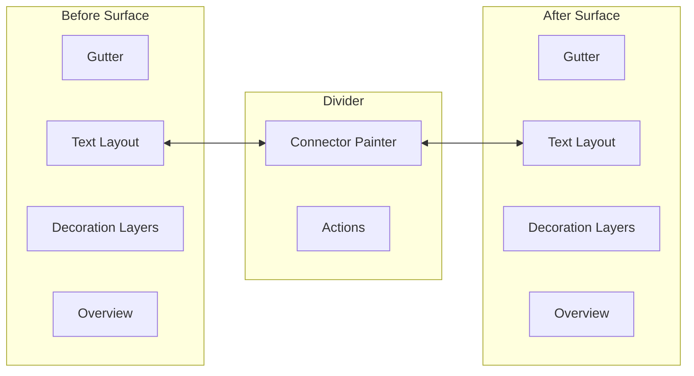

# Text IntelliJ-grade Renderer 与任意资源 Provider 设计

## 1. Text Renderer 的目标形态

文本/代码是第一个高保真实现。它必须提供两个真正连续的编辑器坐标系、中央连接层、多层 decoration、同步滚动、未变化折叠和概览条。现有 Hunk Card Viewer 保留为 Legacy/移动端降级视图，不再作为桌面默认。



## 2. Text 领域模型

### 2.1 文档快照

Rust Runtime 为每个 Version 建立不可变 `TextSnapshot`：

- 原始 bytes digest；
- encoding、BOM、newline policy；
- byte offset ↔ UTF-16 offset ↔ logical line 索引；
- 可选语言、token、symbol/AST index；
- 长行与 binary-like 检测结果。

Flutter 不持有第二份全文字符串；可见窗口按行请求，复制/搜索走 Runtime API。

### 2.2 Diff 结果

```text
TextChangeSet
 ├─ TextChangeBlock[]
 │   ├─ before LogicalLineRange
 │   ├─ after LogicalLineRange
 │   ├─ inner TextFragment[]
 │   ├─ semanticPath / symbol
 │   └─ kind / ignored / confidence
 └─ SimilarBoundary[]
```

`SimilarBoundary` 是同步滚动的关键：边界对必须单调不交叉，首尾分别为 `(0,0)` 和 `(leftLineCount,rightLineCount)`。Change Block 可被过滤或失效，但原始 ChangeSet 保留，以便重建 presentation。

### 2.3 算法策略

1. 快速相等检查：digest / normalized digest。
2. 大文件分区：唯一行锚点或 Patience 风格预匹配。
3. 区间内使用 Myers 计算最短编辑脚本。
4. 对替换块执行 word/character diff；连续中文等脚本按 Unicode code point/grapheme 处理。
5. 可选 AST/Symbol Provider 追加语义路径和 move detection，不改变基础文本证据。
6. 超过 edit-distance、时间或内存预算时分区退化，并在 Quality 中标注。

初始保护参数应可配置，并以 `vendors/intellij-community` 报告中的经验值作为基准实验：最小 edit-distance 预算 20,000、短行噪声阈值约 3 个非空白字符、坏 inline block 阈值约 3 行；发布值必须通过 OpenMuse corpus 基准确定，不能直接视为产品常量。

## 3. 双编辑表面

### 3.1 表面职责

`MuseTextDiffSurface` 是只读优先的编辑表面，包含：

- line/glyph layout；
- gutter line number、fold、change action；
- selection、caret、search hit；
- soft wrap、font scale、tab width；
- decoration layers；
- vertical/horizontal scroll；
- logical ↔ visual ↔ viewport coordinate transform。

它不计算 Diff，也不决定 Actor 颜色。输入是 `TextViewportSlice + TextDecorationPlan + ThemeTokens`。

### 3.2 坐标系统

至少显式区分：

1. ByteOffset：Runtime 内容访问；
2. LogicalPosition：line/column，不含 soft wrap/fold；
3. VisualPosition：含 soft wrap、fold、alignment filler；
4. SurfacePosition：编辑表面内像素；
5. WorkbenchPosition：加上 header/divider/pane offset 后的像素。

所有 Connector 先从 Anchor 解析到 VisualRange，再转换为 WorkbenchPosition。禁止直接用 `line * fixedHeight` 推导端点，因为 soft wrap、字体和 fold 会破坏它。

## 4. Decoration 分层

从低到高：

1. Overview / stripe data；
2. 整行背景；
3. 默认文本与语法高亮；
4. 行内差异；
5. Search/selection/caret；
6. 边界、空范围 marker；
7. Gutter action / diagnostics。

每层只消费 immutable plan。Insert/Delete/Modify 颜色来自 Host Theme；ignored/excluded 通过透明度和边框表达。空插入或空删除使用 2 px marker，不创建伪文本行。

## 5. Divider Connector

### 5.1 几何

对变化块的左右 VisualRange 计算四个端点：`leftTop/leftBottom/rightTop/rightBottom`。连接面使用三次 Bézier 或等价曲面；控制点位于 Divider 宽度约 30% 和 70% 位置，避免折线感。

只有与 viewport 相交的 connector 才创建 Path。绘制顺序：普通 → ignored → hovered/selected；selected connector 提升边框和对比度。

### 5.2 命中与联动

- Divider 保持最小 8 dp 交互命中宽度，即使连接面很薄。
- 悬停连接面同时高亮左右 block 和 Changes Tree 节点。
- 点击连接面定位并选中 Change。
- Apply/Accept 箭头属于 Action Contribution；只读比较不显示，不能由 Renderer 自行写目标 Version。

## 6. 同步滚动

### 6.1 行映射

对 master side 的逻辑行 `x`，找到相邻相似边界 `(x1,y1)` 与 `(x2,y2)`：

```text
if x == x1 -> y1
if x == x2 -> y2
if x > x2  -> y2 + (x - x2)
otherwise  -> min(y1 + (x - x1), y2)
```

这是单调映射，不允许相似边界交叉。实际滚动以 viewport 约 1/3 高度处的 anchor visual line 计算，保留 anchor 行内像素相位；不能只同步 scrollbar 百分比。

### 6.2 防循环

Session 使用 `syncScrollDepth` 或 transaction token：master 滚动触发 slave 更新时，slave 的回调不再反向触发。拖动 scrollbar、键盘翻页、鼠标滚轮、跳转 Change 和程序化恢复都使用同一事务。

### 6.3 水平滚动

默认独立；用户开启“同步水平滚动”后按像素或可见列同步。左右字体/tab/zoom 不一致时禁用，并解释原因。

## 7. Align Changes

对插入/删除造成的视觉高度差，在较短一侧加入不可选择、不可复制的 `AlignmentFiller`。高度基于 VisualLine，而不是 LogicalLine。

重算触发：

- viewport 宽度或 pane 比例变化；
- soft wrap、fold、字体、zoom、tab width 改变；
- ChangeSet revision 改变；
- 领域 inline widget/inlay 高度改变。

采用 300 ms 左右 debounce，计算期间保留旧 plan；提交新 plan 时暂时禁用 sync scroll，恢复 anchor 后再开启。Filler 不能进入 line number、复制文本或审计证据。

## 8. 折叠未变化区

- 两个 change 之间未变化行超过默认阈值时折叠，头尾各保留上下文。
- Fold 是左右关联对象，包含 before/after range、隐藏行数和映射边界。
- 波浪分隔线或“展开 N 行”占位明确表达省略；不是空白区域。
- 展开可以双侧联动，也可暂时单侧展开；单侧展开时 sync mapping 重算。
- 搜索命中、DSH deep link 或 diagnostics 位于折叠区时自动最小范围展开。

## 9. Overview Stripe / Mini-map

首期采用窄 Overview Stripe，不实现完整代码缩略图：

- 按文档逻辑范围投影 Insert/Delete/Modify/Move/Conflict；
- 视口范围显示 thumb；
- 点击/拖动定位；
- 聚合密集变化，不能为每行创建 Widget；
- 选择/搜索/diagnostics 使用不同 lane。

## 10. 文本 Workbench 控制器

```text
MuseTextDiffController
 ├─ TextSessionModel
 ├─ LeftSurfaceController
 ├─ RightSurfaceController
 ├─ SyncScrollController
 ├─ AlignmentController
 ├─ FoldingController
 ├─ ConnectorController
 ├─ ChangeNavigationController
 └─ TextRuntimeClient
```

Controller 持有 session revision。所有异步返回必须携带 revision；Tab 关闭后 controller 取消任务、释放 snapshot handle、scroll listener 和 cache lease。

## 11. 任意资源领域设计矩阵

| 资源 | Semantic IR | Change 粒度 | 默认 Viewer | 关键 Anchors |
|---|---|---|---|---|
| 纯文本/代码 | lines/tokens/symbols/AST | 行、词、symbol、move | 双 Editor + Connector | TextRange/SemanticNode |
| Markdown | block tree + text | heading/list/table/link/code block | 双 Editor 或渲染/源码 | block ID + TextRange |
| DOCX | document/section/paragraph/run/table/media | 内容、格式、移动、结构 | 双页/Track Changes | OOXML stable ID + page region |
| PPTX | deck/slide/shape/text/style/animation | slide、shape、属性、层级 | slide tree + 双画布/overlay | slide/shape ID |
| XLSX | workbook/sheet/cell/formula/style/name | cell/range/formula/结构 | sheet grid + formula inspector | CellRange |
| PDF | page/text span/image/annotation | page、区域、文本、标注 | 双页/overlay/wipe | PageRegion |
| 图片 | pixels/layers/metadata/recognized objects | 区域、图层、元数据 | wipe/blink/heatmap | normalized rect/layer ID |
| HTML/URL 快照 | DOM/CSS/assets | node、attribute、text、layout | DOM tree + rendered overlay | DOM stable path |
| 音频 | tracks/segments/transcript/events | 片段、转写、音量、元数据 | 双 waveform/timeline | TimelineRange |
| 视频 | tracks/scenes/frames/transcript | scene、clip、frame region、字幕 | timeline + frame compare | TimelineRange + region |
| CAD/3D | scene graph/object/mesh/material/property | object、transform、geometry、property | scene tree + ghost overlay | SceneObject |
| 未知二进制 | metadata/chunks | digest、size、chunk | binary summary/hex plugin | BinaryRange |

### 11.1 Provider 领域责任

每个 Provider 必须实现：

- Canonicalize：消除不影响用户语义的容器噪声；
- Stable identity：尽量识别同一对象跨版本的身份；
- Compare：生成结构化 Change；
- Explain：生成本地化 label 和可审计摘要；
- Anchor projection data：为 Renderer 提供定位依据；
- Quality：声明启发式、丢失和退化。

Provider 不实现 Host Toolbar、Tab、审计权限、Version Store 或跨领域 Workflow。

### 11.2 Renderer 领域责任

Renderer 负责：

- Anchor → viewport 坐标；
- 领域表面与交互；
- Change selection/hover/navigation；
- 可见窗口加载和缓存；
- 对 Host Command 的能力声明；
- Accessibility tree。

Renderer 不重新解释 Version 身份，不修改 Audit，不绕过 Action Service 写资源。

## 12. 三方合并预埋

3-way 输入为 `local/base/incoming`。通用 ChangeSet 支持 `conflict`、`originSide` 和关系引用；Text Renderer 预留三栏和结果栏模式，但 1.0 只交付 2-way。Accept/Reject/Apply 走独立 Action Service，并在应用前检查目标 head 是否仍是预期版本。

## 13. Legacy 迁移映射

| 现有类型 | 1.0 位置 | 处理 |
|---|---|---|
| `MuseTextDiffPayload` | legacy provider payload | Adapter 转 `TextChangeSet`，随后弃用 |
| `MuseTextDiffHunk` | `TextChangeBlock` 的旧投影 | 不作为 UI 容器 |
| `MuseTextDiffRow` | viewport slice line | 按需生成，不全量常驻 Dart |
| `MuseTextDiffViewer` | Legacy Hunk Renderer | 移动端/失败回退 |
| `_HunkCard` | 无 | 桌面默认删除 |
| `MuseComparison.rendererType` | routing hint | 兼容保留，逐步由 registry 协商取代 |
| audit `before/after` preview | 不合规旧 metadata | 新事件停止写入，按需派生 |

